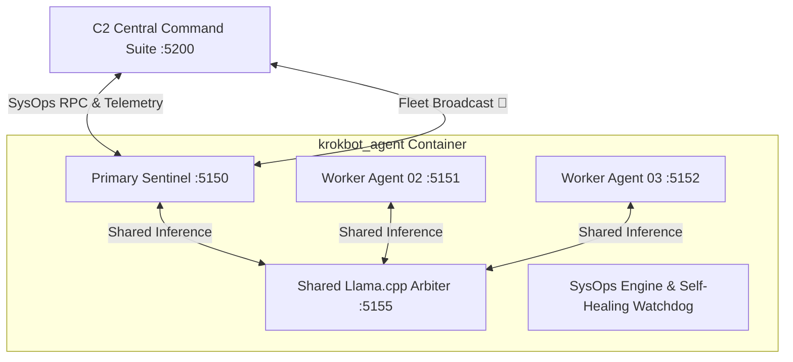

# KrokBot - Autonomous Edge Compute Multi-Agent Platform

KrokBot is a high-performance, containerized multi-agent system designed for **edge compute devices** (such as NVIDIA Jetson Orin Nano, industrial x86/ARM micro-nodes, and workstations). It provides autonomous diagnostic scripting, self-healing system operations, hardware thermal tracking, and a centralized Command & Control (C2) fleet manager.

---

## Architecture & Edge Compute Design

Rather than running multiple heavy containers that exhaust edge device memory, KrokBot deploys a **Single Master Container** architecture:

* **Primary Sentinel (`krok-prime-01`, Port 5150)**: Manages node lifecycle, cron tasks, and edge SysOps.
* **Lightweight Co-Located Worker Agents**: Dynamically spawned on separate ports with isolated workspace directories (`/app/workspaces/agent_<id>`).
* **Shared In-Container Llama.cpp Arbiter (`Port 5155`)**: Loads quantized GGUF models once in VRAM/RAM, serving OpenAI-compatible ChatML inference to all co-located agents simultaneously.
* **Embedded Local Search MCP Suite**:
  * **SearXNG Search Engine (`Port 5160`)**: Privacy-first meta-search engine aggregating web search results.
  * **FastMCP Search Tool Server (`Port 5165`)**: Local Model Context Protocol endpoint providing web search and scraper tooling.
* **Edge SysOps Engine**:
  * **Hardware Diagnostics**: Direct reading of SoC thermal package sensors (`max_temp_c`), storage partitions, and network I/O.
  * **Container Process Supervisor**: Fast `psutil` sampling with strict safety guards protecting PID 1, system init daemons, and sentinel agents (`HTTP 403 Forbidden`).
  * **Operational Memory Trimmer**: Releases fragmented heap back to the OS kernel via Linux glibc `malloc_trim(0)`.
  * **Self-Healing Watchdog**: Autonomous rules evaluating storage pressure (>85%), thermal throttling (>75°C), worker memory leaks (>800 MB), and inference heartbeats.
* **C2 Central Command Suite (`Port 5200`)**: Next.js / React C2 dashboard featuring expandable edge device tabs, live SoC thermal chips, a live Process Inspector modal, and parallel Fleet Command Broadcasting.



---

## Quickstart & Docker Deployment

Launch the all-in-one container with embedded Llama.cpp runtime, Sentinel, and SysOps engine:

```bash
# Place your GGUF model into ./models (e.g. qwen2.5-coder-1.5b-instruct-q4_k_m.gguf)
# Build and launch all services with Docker Compose:
docker compose up --build -d
```

Start the C2 Central Command dashboard:

```bash
cd control_center
npm run dev
```

### Access Ports & Services
- **C2 Fleet Control Center**: `http://localhost:5200`
- **Primary Agent Dashboard & API**: `http://localhost:5150`
- **Shared Llama.cpp Server**: `http://localhost:5155/v1/models`
- **Embedded SearXNG Engine**: `http://localhost:5160`
- **FastMCP Search Tool Server**: `http://localhost:5165`
- **Host API Bridge**: `http://localhost:8992`

---

## Testing & Quality Verification

Run the full end-to-end regression suites:

```powershell
# 1. Run C2 TypeScript Test Suite (40/40 tests passing)
cd control_center
npm test

# 2. Run Python Agent & SysOps Test Suite (26/26 tests passing)
cd ..
pytest tests/ -v
```

---

## Documentation

- [Edge Compute SysOps & Fleet Operations Guide](docs/EDGE_COMPUTE_SYSOPS_GUIDE.md)
- [System Validation Test Suite (Tests 01-07)](docs/SYSTEM_VALIDATION_TEST_SUITE.md)
- [Automated Functional Test Results Report](docs/AUTOMATED_FUNCTIONAL_TEST_RESULTS.md)

