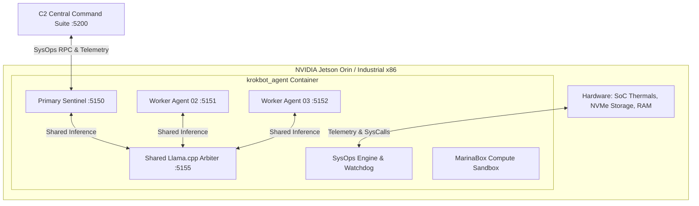

# KrokBot Edge Compute SysOps & Fleet Operations Guide

> **Target Hardware**: Edge Compute Devices (NVIDIA Jetson Orin Nano, Industrial x86/ARM Micro-Nodes, Edge Workstations)  
> **Runtime Environment**: Containerized Multi-Agent Swarm with Shared In-Container Llama.cpp Inference  
> **Engineering Standard**: Google Senior Staff SWE & Product Infrastructure Standard

---

## 1. System Architecture Overview

KrokBot is an autonomous, multi-agent edge compute operations platform designed for embedded and industrial hardware. Rather than running separate heavy containers for each subagent (which exhausts edge RAM), KrokBot uses a **single master container architecture** where:

1. A **Primary Sentinel** agent (`krok-prime-01`, Port `5150`) manages the node lifecycle, schedules, and SysOps subsystems.
2. Multiple **Lightweight Worker Agents** (`krok-worker-02`, etc.) run in segregated workspace sandboxes (`/app/workspaces/agent_<id>`).
3. An **In-Container Llama.cpp Arbiter** (`127.0.0.1:5155`) hosts quantized GGUF models in memory once and shares high-throughput inference across all co-located agents.
4. An **Edge SysOps Engine** proactively monitors hardware thermals, enforces process safety, prunes storage pressure, and triggers automatic self-healing remediations.
5. The **C2 Control Center** (`http://localhost:5200`) provides centralized multi-node fleet management, live process inspection, and parallel command broadcasting.



---

## 2. Edge Compute SysOps Engine

The SysOps subsystem is implemented in [`krokbot/sysops/`](file:///g:/antigravity_projects/krokbot/krokbot/sysops/):

### 2.1 Hardware-Aware Diagnostics (`diagnostics.py`)
- **Thermal Sensors**: Inspects `/sys/class/thermal/thermal_zone*` on Linux/Jetson and WMI/psutil on Windows. Automatically calculates `max_temp_c`, zone status, and flags thermal throttling when temperatures cross **75.0°C**.
- **Isolated Storage Mounts**: Evaluates disk capacity and percent utilization across all active mount points (`/`, `/app`, `/app/data`). Flags warning when utilization exceeds **85.0%**.
- **Network I/O**: Reads system network interfaces, tracking transfer volume (sent/received MB), packet counts, and socket drop/error metrics.
- **Top Processes**: Gathers sorted CPU and RSS memory consumption with millisecond latency.

### 2.2 Container Process Supervisor (`processes.py`)
- **Process Table Sampling**: Uses streamlined `psutil` sampling restricted to essential attributes (`['pid', 'name', 'cpu_percent', 'memory_info', 'status']`) to avoid slow Win32 security token lookups.
- **Safety Protection Rules**:
  - `PID 1` (Container init / supervisor) is strictly protected.
  - Current process (`os.getpid()`) and parent process (`os.getppid()`) are strictly protected.
  - Critical daemon process names (`tini`, `docker-init`, `systemd`, `init`, `krokbot`, `python3`) are safeguarded against remote termination.
  - Attempts to kill protected processes return `HTTP 403 Forbidden: PID <pid> is protected by edge safety policy and cannot be terminated.`
- **Operational System Cleanup**:
  - Executes Python full garbage collection (`gc.collect()`).
  - Invokes Linux glibc `ctypes.CDLL("libc.so.6").malloc_trim(0)` to immediately release fragmented heap memory back to the host operating system kernel.
  - Prunes temporary workspace scratch files and stale caches.

### 2.3 Self-Healing Watchdog Engine (`watchdog.py`)
Runs an autonomous evaluation loop against predefined edge compute operational policies:

| Policy ID | Name | Trigger Threshold | Remediation Action | Cooldown |
| :--- | :--- | :--- | :--- | :--- |
| `policy_storage_pressure` | Storage Pressure & Cache Pruning | Storage usage > 85.0% | Prunes `/app/workspaces/*/scratch` and flushes cache. | 60s |
| `policy_thermal_guard` | Edge SoC Thermal Throttling Guard | Max Temp > 75.0°C | Broadcasts `krok.sysops.thermal_alert` event on KrokBus. | 45s |
| `policy_worker_memory` | Worker Memory Leak Protection | Worker RSS > 800 MB | Triggers Python GC and glibc `malloc_trim(0)`. | 30s |
| `policy_inference_heartbeat` | Llama.cpp Inference Watchdog | Arbiter unresponsive | Pings `127.0.0.1:5155/v1/models`; flags arbiter restart. | 60s |

All watchdog remediations are published to the internal `KrokBus` event pub/sub bus and logged into the persistent audit trail.

---

## 3. Central Command (C2) Fleet Operations

The C2 Control Center (`http://localhost:5200`) provides interactive operational controls tailored for edge compute swarms:

### 3.1 Edge Device Summary Line
Each registered node features an expandable accordion with an always-visible summary line containing:
- **Connection Status**: Glowing green radar pulse when online.
- **Container CPU**: Real-time load percentage.
- **RAM Consumption**: Real-time GB used and percent of physical memory.
- **Active Shared Model**: Truncated GGUF filename.
- **SoC Thermal Chip (`🌡️ 44.1°C`)**: Live hardware thermal package temperature. Turns pulsating red upon thermal warning.
- **Active Agents Pill**: `X Active / Y Total` agents currently running.
- **Quick Action Buttons**:
  - `⚙️ SysOps`: Launches the Live Process Inspector Modal.
  - `🧹 Clean`: Triggers memory heap trimming and temporary cache cleanup.
  - `🧠 Model`: Launches the GGUF model hot-swap modal.
  - `+ Deploy`: Instantiates a new co-located worker agent.
  - `🗑️`: Unregisters remote edge node from the C2 fleet database.

### 3.2 Live Process Inspector Modal (`⚙️ SysOps`)
- Renders full running process table inside the container.
- Displays PID, process name, RSS memory in MB, and CPU %.
- Displays green `PROTECTED` badges and disables actions for system core processes.
- Displays active red `Terminate` buttons for non-critical worker processes.

### 3.3 Fleet-Wide Parallel Command Broadcast
Located in the Autonomous Agent Command Console:
- **Mode Selector**: `[ 🎯 Single Target ]` vs `[ 📡 Fleet Broadcast (All Nodes) ]`.
- **Parallel Dispatch**: In broadcast mode, the prompt is dispatched concurrently across all registered edge nodes in the fleet via `Promise.allSettled`.
- **Audit Logging**: Each node's execution duration and exit status are independently recorded in the C2 Audit Log.

---

## 4. REST API Reference

### Agent In-Container Endpoints (Port 5150)

#### `GET /api/sysops/telemetry`
Returns comprehensive hardware diagnostics, thermals, storage mounts, and network metrics.
```json
{
  "status": "success",
  "diagnostics": {
    "timestamp": "2026-09-11 22:02:18",
    "cpu": { "total_percent": 12.4, "cores": 8 },
    "thermals": {
      "max_temp_c": 44.1,
      "status": "NOMINAL",
      "is_throttling": false,
      "sensors": [{ "zone": "soc_thermal_0", "label": "SoC Core Package", "temp_c": 44.1 }]
    },
    "storage": [
      { "mount": "/", "total_gb": 1006.85, "used_gb": 35.64, "free_gb": 920.0, "percent": 3.5, "is_warning": false }
    ],
    "network": { "bytes_sent_mb": 4.12, "bytes_recv_mb": 8.45, "errin": 0, "errout": 0 },
    "top_processes": [...]
  }
}
```

#### `GET /api/sysops/processes`
Lists all active container processes with RSS memory and CPU metrics.

#### `POST /api/sysops/processes/{pid}/kill?force={true|false}`
Terminates a non-critical worker process. Rejects protected processes with `HTTP 403 Forbidden`.

#### `POST /api/sysops/cleanup`
Executes Python GC, libc `malloc_trim(0)`, and temporary workspace pruning.
```json
{
  "status": "success",
  "result": {
    "gc_objects_collected": 64,
    "malloc_trimmed": true,
    "temp_files_pruned": 0,
    "memory_recovered_mb": 0.43,
    "timestamp": "2026-09-11 22:02:23"
  }
}
```

#### `GET /api/sysops/watchdog/policies`
Returns list of self-healing policies, thresholds, and last triggered timestamps.

#### `POST /api/sysops/watchdog/policies/{policy_id}/toggle`
Toggles policy between active and disabled states.

---

### C2 Control Center Endpoints (Port 5200)

| Endpoint | Method | Description |
| :--- | :--- | :--- |
| `/api/fleet/nodes/[nodeId]/sysops/telemetry` | `GET` | Proxies hardware telemetry and thermals for node. |
| `/api/fleet/nodes/[nodeId]/sysops/processes` | `GET` | Proxies live process list for node. |
| `/api/fleet/nodes/[nodeId]/sysops/processes/[pid]/kill` | `POST` | Safely terminates process; logs action in audit trail. |
| `/api/fleet/nodes/[nodeId]/sysops/cleanup` | `POST` | Triggers memory trimming and storage pruning. |
| `/api/fleet/nodes/[nodeId]/sysops/watchdog` | `GET` / `POST` | Inspects and toggles watchdog policies. |
| `/api/fleet/broadcast` | `POST` | Dispatches instruction concurrently to all fleet nodes. |

---

## 5. Automated Verification & Testing Commands

To run the complete automated test suite verifying the SysOps subsystem:

```powershell
# Run C2 Control Center unit tests (40/40 tests)
cd control_center
npm test

# Run Python Agent & SysOps unit tests (26/26 tests)
cd ..
pytest tests/test_sysops.py -v
```
