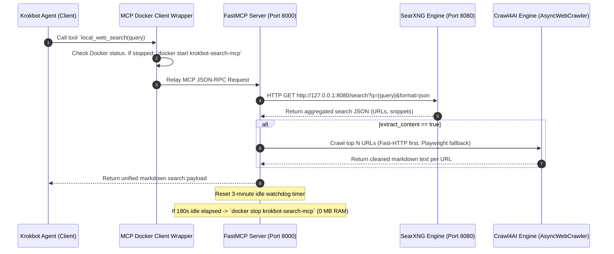

# Design Spec: Local SearXNG + Crawl4AI MCP Search Integration

**Project**: Krokbot Agent Framework  
**Date**: 2026-09-14  
**Status**: Draft / Ready for Implementation  

---

## 1. Executive Summary

This specification defines the architecture, component interaction, resource management, and file structure for adding a fully local internet search and data extraction capability to the Krokbot AI Agent via the **Model Context Protocol (MCP)**.

The solution combines **SearXNG** (meta-search engine) and **Crawl4AI** (LLM-optimized web content scraper/markdown extractor) inside a **single Docker container**, fronted by a unified Python **FastMCP server**. 

To satisfy the strict constraint of minimal resource overhead, the architecture uses an **On-Demand Lazy-Start with Adaptive Idle Shutdown**:
* **Idle RAM**: **0 MB** (Container is stopped when not searching).
* **Warm Window RAM**: **~140 MB** (SearXNG + MCP server alive for fast subsequent queries).
* **Peak Crawl RAM**: **~350 MB - 500 MB** (Playwright Chromium invoked on-demand and closed immediately post-extraction).

---

## 2. System Architecture & Data Flow



---

## 3. Directory & File Layout

All code and configurations are located in the `krokbot` project repository:

```
krokbot/
├── docs/
│   ├── local-search-mcp-design.md              <-- This design spec
│   └── superpowers/
│       └── specs/
│           └── 2026-09-14-local-search-mcp-design.md
├── docker/
│   └── search-mcp/
│       ├── Dockerfile
│       ├── supervisord.conf
│       └── searxng/
│           └── settings.yml
├── src/
│   └── tools/
│       └── search_mcp/
│           ├── mcp_server.py           <-- FastMCP Tool implementation
│           ├── crawler_service.py      <-- Crawl4AI extraction logic
│           └── watchdog.py             <-- 180s Idle auto-shutdown daemon
├── client/
│   └── mcp_docker_wrapper.py   <-- Client-side Docker lazy-starter wrapper
└── requirements.txt
```

---

## 4. Detailed Component Specifications

### 4.1 SearXNG Configuration (`docker/search-mcp/searxng/settings.yml`)
* Enables JSON format (`search.format: ["json", "html"]`).
* Prunes unused search engines to optimize memory and CPU usage. Active engines: `google`, `duckduckgo`, `bing`, `wikipedia`, `github`.
* Binds internally to `127.0.0.1:8080`.

### 4.2 Crawl4AI Content Extractor (`src/tools/search_mcp/crawler_service.py`)
* Dual-mode strategy:
  1. **Fast-HTTP mode**: Attempts non-JS async HTML fetching first (`aiohttp`/`httpx`).
  2. **Playwright Chromium fallback**: Used only if dynamic JS rendering is required.
* **Critical Memory Constraint**: Playwright Chromium browser contexts **must** be created inside an `async with` context manager and closed immediately after page scraping completes.

### 4.3 Unified FastMCP Handoff Server (`src/tools/search_mcp/mcp_server.py`)
Exposes a single optimized tool to the agent:

```python
@mcp.tool()
async def local_web_search(
    query: str,
    max_results: int = 3,
    extract_content: bool = True
) -> str:
    """
    Performs a local internet search via SearXNG and retrieves page contents via Crawl4AI.
    Returns cleaned Markdown formatted for LLM ingestion.
    """
```

### 4.4 Idle Watchdog (`src/tools/search_mcp/watchdog.py`)
* Monitors the timestamp of the last processed MCP tool request.
* If `current_time - last_request_time > 180 seconds`:
  * Issues container shutdown / clean exit to trigger Docker container stop.

### 4.5 Container Runtime & Supervisor (`docker/search-mcp/Dockerfile` & `supervisord.conf`)
* Base image: `python:3.11-slim`.
* Installs dependencies: `playwright install chromium --with-deps`.
* Uses `supervisord` to manage `searxng`, `mcp_server`, and `watchdog`.

---

## 5. Verification & Test Plan

1. **Docker Container Build & Cold-Start Test**:
   ```bash
   docker build -t krokbot-search-mcp -f docker/search-mcp/Dockerfile .
   docker run -d --name krokbot-search-mcp -p 8000:8000 krokbot-search-mcp
   ```
2. **MCP Tool Functionality Verification**:
   * Send JSON-RPC tool call payload for `local_web_search`.
   * Verify SearXNG returns results and Crawl4AI returns clean Markdown.
3. **Memory Footprint Audit**:
   * Verify idle memory before query: **0 MB** (when container stopped).
   * Verify warm memory during idle window: **< 150 MB RAM**.
   * Verify peak memory during crawl: **< 500 MB RAM**.
   * Verify idle auto-stop after 3 minutes: container stops, RAM drops to **0 MB**.

---

## 6. Execution Instructions for Antigravity

When executing this spec inside an IDE session:
1. Scaffold the file structure under `E:\AI-Coding\projects\krokbot\`.
2. Populate configuration files (`settings.yml`, `supervisord.conf`, `Dockerfile`).
3. Implement `crawler_service.py`, `mcp_server.py`, and `watchdog.py`.
4. Test container build and run integration test script.
