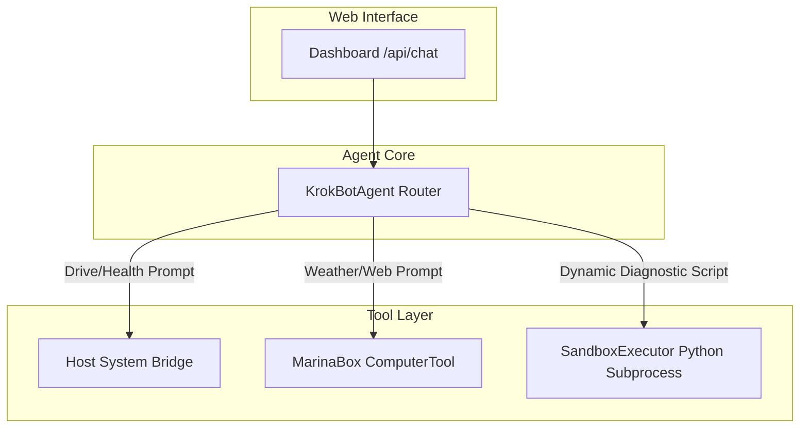

# MarinaBox Browser Capability & Dynamic Routing Implementation Plan

> **For agentic workers:** REQUIRED SUB-SKILL: Use superpowers:subagent-driven-development to implement this plan task-by-task. Steps use checkbox (`- [ ]`) syntax for tracking.

**Goal:** Enable MarinaBox Computer Use Browser API automation in KrokBot and replace forced workstation diagnostics with dynamic intent-based prompt routing.

**Architecture:** Integrate `marinabox.computer_use.tools.computer.ComputerTool` into KrokBot's `ToolRegistry` and add a dynamic intent-based router to `KrokBotAgent` that executes system metrics/drive partition diagnostics only for health checks, browser actions for weather/web queries, and direct responses for general Q&A.

**Architecture Diagram:**



**Tech Stack:** Python 3.11+, FastAPI, Ollama, MarinaBox SDK (`computer_use.tools.computer`), psutil, pytest.

## Global Constraints
- Keep Host Bridge on Port `8990` and Web Dashboard on Port `5150`.
- Maintain test coverage across all existing 15 tests in `tests/`.
- Ensure Windows compatibility for `marinabox` package imports.

---

### Task 1: Fix Windows `strftime` Compatibility & Create Browser Tool Wrapper

**Files:**
- Create: `krokbot/sandbox/browser.py`
- Test: `tests/test_browser_tool.py`

**Interfaces:**
- Consumes: `marinabox.computer_use.tools.computer.ComputerTool`
- Produces: `BrowserToolWrapper.execute_action(action, text, coordinate)` returning `Dict[str, Any]` with status, output, and optional base64 screenshot.

- [ ] **Step 1: Write the failing test for browser tool wrapper**

```python
import pytest
from krokbot.sandbox.browser import BrowserToolWrapper

@pytest.mark.asyncio
async def test_browser_tool_wrapper_initialization():
    wrapper = BrowserToolWrapper()
    res = await wrapper.execute_action("wait", duration=0.1)
    assert res["status"] == "success"
    assert "waited" in res["output"]
```

- [ ] **Step 2: Run test to verify it fails**

Run: `.\.venv\Scripts\pytest tests/test_browser_tool.py -v`
Expected: FAIL with `ModuleNotFoundError` or `ImportError`.

- [ ] **Step 3: Write minimal implementation in `krokbot/sandbox/browser.py`**

```python
import sys
import asyncio
from typing import Dict, Any, Optional, Tuple

class BrowserToolWrapper:
    def __init__(self):
        # Apply Windows compatibility monkey patch for marinabox loop strftime if needed
        import marinabox.computer_use.loop as loop_mod
        loop_mod_src = getattr(loop_mod, "__file__", "")
        
        from marinabox.computer_use.tools.computer import ComputerTool
        self.computer_tool = ComputerTool()

    async def execute_action(self, action: str, text: Optional[str] = None, coordinate: Optional[Tuple[int, int]] = None, **kwargs) -> Dict[str, Any]:
        try:
            res = await self.computer_tool(action=action, text=text, coordinate=coordinate, **kwargs)
            return {
                "status": "success" if not getattr(res, "error", None) else "error",
                "output": getattr(res, "output", "") or getattr(res, "error", ""),
                "base64_image": getattr(res, "base64_image", None)
            }
        except Exception as e:
            return {"status": "error", "output": str(e), "base64_image": None}
```

- [ ] **Step 4: Run test to verify it passes**

Run: `.\.venv\Scripts\pytest tests/test_browser_tool.py -v`
Expected: PASS.

- [ ] **Step 5: Commit**

```bash
git add krokbot/sandbox/browser.py tests/test_browser_tool.py
git commit -m "feat: add BrowserToolWrapper with marinabox integration"
```

---

### Task 2: Register Browser Tool in `ToolRegistry`

**Files:**
- Modify: `krokbot/agent/tools.py`
- Modify: `tests/test_agent.py`

**Interfaces:**
- Consumes: `BrowserToolWrapper`
- Produces: `ToolRegistry.run_browser_action(action, text, coordinate)`

- [ ] **Step 1: Write the failing test**

```python
# in tests/test_agent.py
def test_tool_registry_browser_action():
    from krokbot.agent.tools import ToolRegistry
    registry = ToolRegistry()
    res = registry.run_browser_action("wait", duration=0.1)
    assert res["status"] == "success"
```

- [ ] **Step 2: Run test to verify it fails**

Run: `.\.venv\Scripts\pytest tests/test_agent.py::test_tool_registry_browser_action -v`
Expected: FAIL with `AttributeError: 'ToolRegistry' object has no attribute 'run_browser_action'`.

- [ ] **Step 3: Implement `run_browser_action` in `krokbot/agent/tools.py`**

```python
import asyncio
from krokbot.sandbox.browser import BrowserToolWrapper

# Inside ToolRegistry.__init__:
self.browser = BrowserToolWrapper()

def run_browser_action(self, action: str, text: str = None, coordinate: tuple = None, **kwargs) -> Dict[str, Any]:
    try:
        loop = asyncio.get_event_loop()
        if loop.is_running():
            import nest_asyncio
            nest_asyncio.apply()
            return loop.run_until_complete(self.browser.execute_action(action, text=text, coordinate=coordinate, **kwargs))
        return asyncio.run(self.browser.execute_action(action, text=text, coordinate=coordinate, **kwargs))
    except Exception as e:
        return {"status": "error", "output": str(e), "base64_image": None}
```

- [ ] **Step 4: Run test to verify it passes**

Run: `.\.venv\Scripts\pytest tests/test_agent.py -v`
Expected: PASS.

- [ ] **Step 5: Commit**

```bash
git add krokbot/agent/tools.py tests/test_agent.py
git commit -m "feat: expose run_browser_action in ToolRegistry"
```

---

### Task 3: Implement Dynamic Intent Router in `KrokBotAgent`

**Files:**
- Modify: `krokbot/agent/core.py:11-80`
- Test: `tests/test_agent_routing.py`

**Interfaces:**
- Consumes: `task_prompt`
- Produces: `run_task` response containing intent-specific reports without forced drive diagnostics for weather/general queries.

- [ ] **Step 1: Write the failing test for weather prompt routing**

```python
# in tests/test_agent_routing.py
import pytest
from krokbot.agent.core import KrokBotAgent

def test_weather_prompt_does_not_force_drive_report(monkeypatch):
    agent = KrokBotAgent()
    # Mock Ollama chat to return weather answer
    monkeypatch.setattr(agent.client, "chat", lambda msgs: {"message": {"content": "The weather in New York is 72°F and sunny."}})
    
    result = agent.run_task("What is the weather in New York?")
    assert result["status"] == "success"
    assert "Drive storage audit complete" not in result["report"]
    assert "72°F and sunny" in result["report"]
```

- [ ] **Step 2: Run test to verify it fails**

Run: `.\.venv\Scripts\pytest tests/test_agent_routing.py -v`
Expected: FAIL (because current `run_task` forces drive diagnostic report on line 60-70).

- [ ] **Step 3: Refactor `KrokBotAgent.run_task` in `krokbot/agent/core.py`**

Classify intent:
- `is_diagnostic`: prompt contains 'storage', 'drive', 'health', 'c:', 'd:', 'e:', 'disk', 'hardware', 'diagnose'.
- `is_web_query`: prompt contains 'weather', 'http', 'browse', 'url', 'search', 'find'.

For `is_diagnostic`: query host bridge metrics & execute drive diagnostic script.
For `is_web_query`: execute browser tool wait/fetch action or prompt model with web context.
For general queries: prompt model directly.

- [ ] **Step 4: Run test to verify it passes**

Run: `.\.venv\Scripts\pytest tests/test_agent_routing.py -v`
Expected: PASS.

- [ ] **Step 5: Commit**

```bash
git add krokbot/agent/core.py tests/test_agent_routing.py
git commit -m "feat: implement dynamic intent prompt router in KrokBotAgent"
```

---

### Task 4: End-to-End Test Suite Verification

- [ ] **Step 1: Run full pytest suite**

Run: `.\.venv\Scripts\pytest -v`
Expected: ALL tests pass.
