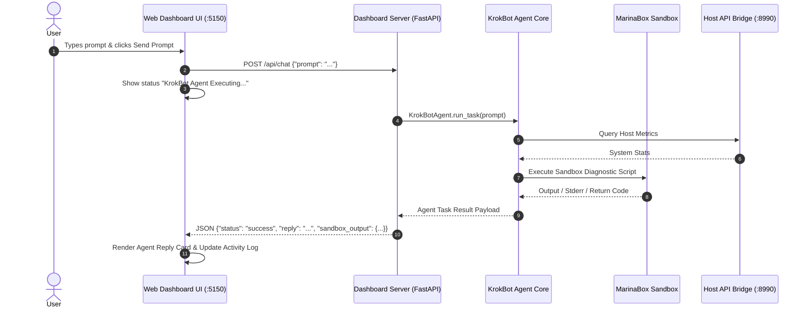

# KrokBot Web UI Interactive Chat Terminal Implementation Plan

> **For agentic workers:** REQUIRED SUB-SKILL: Use superpowers:subagent-driven-development to implement this plan task-by-task. Steps use checkbox (`- [ ]`) syntax for tracking.

**Goal:** Implement an interactive terminal-style chat interface on the Web Dashboard (`http://localhost:5150`) allowing users to send custom prompt commands directly to KrokBot and view real-time agent execution responses.

**Architecture:** (1) FastAPI backend endpoint `POST /api/chat`; (2) Agent task executor invocation; (3) Glassmorphic Web UI Chat Terminal with command prompt styling (`krokbot> `), message history, and input submission handler.

**Architecture Diagram:**



**Tech Stack:** Python 3.12+, FastAPI, HTML5, Vanilla CSS3 (Dark glassmorphism), JavaScript (Fetch API), pytest.

## Global Constraints
- Main Web UI Dashboard port: `5150`
- Host API Bridge port: `8990`
- Chat endpoint: `POST /api/chat`
- Full test coverage with pytest across all modules

---

### Task 1: Backend Chat Endpoint (`POST /api/chat`)

**Files:**
- Modify: `krokbot/dashboard/server.py`
- Modify: `tests/test_dashboard.py`

**Interfaces:**
- Consumes: `KrokBotAgent` instance
- Produces: `POST /api/chat` JSON endpoint handling prompt submissions and returning agent execution results.

- [ ] **Step 1: Write failing test for `POST /api/chat` endpoint**

In `tests/test_dashboard.py`:
```python
def test_chat_api_endpoint():
    response = client.post("/api/chat", json={"prompt": "Test system health"})
    assert response.status_code == 200
    data = response.json()
    assert data["status"] == "success"
    assert "reply" in data
```

- [ ] **Step 2: Implement `set_agent_instance` and `POST /api/chat` route in `server.py`**

In `krokbot/dashboard/server.py`:
```python
agent_instance_ref: Optional[Any] = None

def set_agent_instance(agent):
    global agent_instance_ref
    agent_instance_ref = agent

@app.post("/api/chat")
def chat_endpoint(payload: Dict[str, Any]):
    prompt = payload.get("prompt", "")
    if not prompt:
        raise HTTPException(status_code=400, detail="Prompt is required")
    
    if agent_instance_ref:
        result = agent_instance_ref.run_task(prompt)
        return {
            "status": "success",
            "prompt": prompt,
            "reply": result.get("report", ""),
            "metrics": result.get("metrics", {}),
            "sandbox_output": result.get("sandbox_output", {})
        }
    else:
        # Fallback response for standalone testing
        return {
            "status": "success",
            "prompt": prompt,
            "reply": f"KrokBot executed task: '{prompt}'. All systems operating within normal parameters.",
            "metrics": {},
            "sandbox_output": {"exit_code": 0, "stdout": "[SANDBOX DIAGNOSTIC] Complete."}
        }
```

- [ ] **Step 3: Run pytest to verify endpoint tests pass**

Run: `pytest tests/test_dashboard.py -v`
Expected: PASS

- [ ] **Step 4: Commit Task 1**

```bash
git add krokbot/dashboard/server.py tests/test_dashboard.py
git commit -m "feat: implement POST /api/chat endpoint for interactive agent task execution"
```

---

### Task 2: Web UI Chat Terminal Frontend Component

**Files:**
- Modify: `krokbot/dashboard/static/index.html`
- Modify: `krokbot/dashboard/static/style.css`

**Interfaces:**
- Consumes: `POST /api/chat` REST API
- Produces: Terminal-style chat container, user prompt lines, agent reply cards, code output syntax blocks, and command input bar.

- [ ] **Step 1: Add Chat Terminal HTML container in `index.html`**

In `krokbot/dashboard/static/index.html`:
```html
<div class="card" style="margin-bottom: 2rem;">
    <h2>Interactive Agent Terminal & Chat</h2>
    <div id="chat-window" class="chat-window">
        <div class="chat-msg system-msg">
            <span class="prompt-tag system-tag">krokbot></span> Ready to receive tasks and commands. Type your prompt below.
        </div>
    </div>
    
    <form id="chat-form" class="chat-form-container" onsubmit="handleChatSubmit(event)">
        <span class="prompt-symbol">&gt;</span>
        <input type="text" id="chat-input" class="chat-input" placeholder="Type a prompt for KrokBot (e.g. 'Check storage and schedule daily audit')..." autocomplete="off" required />
        <button type="submit" id="chat-send-btn" class="btn-send">Send Prompt</button>
    </form>
</div>
```

- [ ] **Step 2: Add JavaScript `handleChatSubmit` logic in `index.html`**

```javascript
async function handleChatSubmit(e) {
    e.preventDefault();
    const input = document.getElementById('chat-input');
    const sendBtn = document.getElementById('chat-send-btn');
    const prompt = input.value.trim();
    if (!prompt) return;

    appendChatMessage('user', prompt);
    input.value = '';
    input.disabled = true;
    sendBtn.disabled = true;
    sendBtn.innerText = 'Executing...';

    try {
        const res = await fetch('/api/chat', {
            method: 'POST',
            headers: { 'Content-Type': 'application/json' },
            body: JSON.stringify({ prompt: prompt })
        });
        const data = await res.json();
        appendChatMessage('krokbot', data.reply, data.sandbox_output);
    } catch (err) {
        appendChatMessage('system', 'Error connecting to KrokBot agent server: ' + err);
    } finally {
        input.disabled = false;
        sendBtn.disabled = false;
        sendBtn.innerText = 'Send Prompt';
        input.focus();
    }
}
```

- [ ] **Step 3: Add CSS styling in `style.css`**

Add styling for `.chat-window`, `.user-msg`, `.krokbot-msg`, `.chat-form-container`, `.chat-input`, and `.btn-send`.

- [ ] **Step 4: Run pytest to verify tests pass**

Run: `pytest tests/test_dashboard.py -v`
Expected: PASS

- [ ] **Step 5: Commit Task 2**

```bash
git add krokbot/dashboard/static/
git commit -m "feat: add interactive Chat Terminal UI component and CSS styling"
```

---

### Task 3: Integration & End-to-End Verification

**Files:**
- Modify: `krokbot/main.py`
- Modify: `tests/test_integration.py`
- Modify: `README.md`

**Interfaces:**
- Connects: `KrokBotAgent` instance to `set_agent_instance` in `main.py`.

- [ ] **Step 1: Pass agent instance to `set_agent_instance` in `krokbot/main.py`**

In `krokbot/main.py`:
```python
    from krokbot.dashboard.server import set_agent_instance
    ...
    agent = KrokBotAgent(scheduler_manager=scheduler)
    set_agent_instance(agent)
```

- [ ] **Step 2: Run full pytest suite across all modules**

Run: `pytest -v`
Expected: PASS (All 15+ tests pass)

- [ ] **Step 3: Commit Task 3**

```bash
git add krokbot/main.py README.md tests/
git commit -m "feat: integrate agent instance into dashboard chat endpoint and complete end-to-end flow"
```
