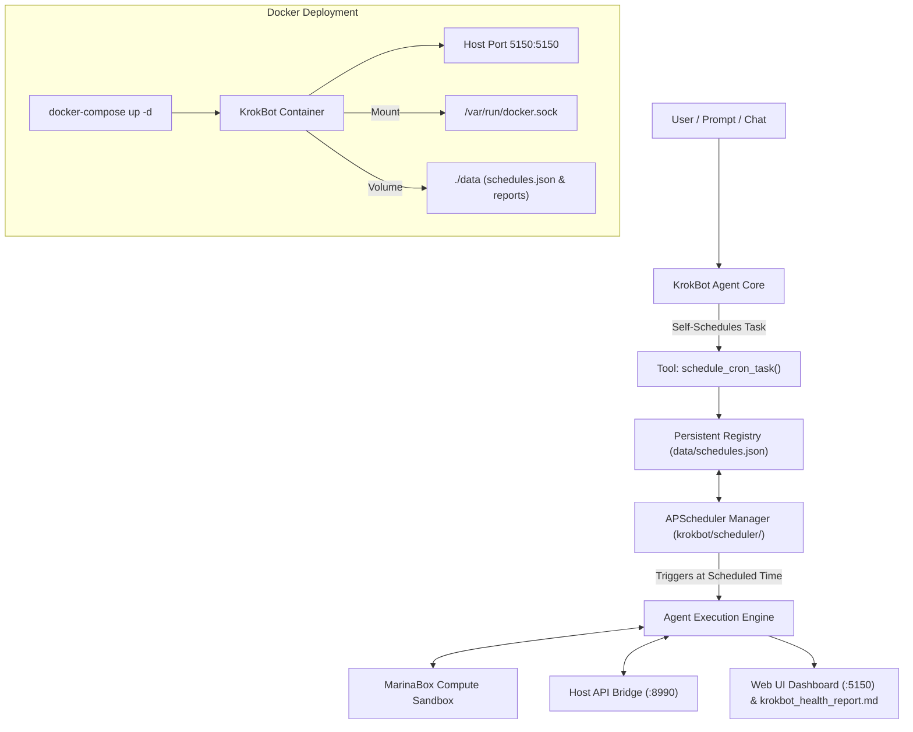

# KrokBot Cron Scheduler, Port 5150 & Docker Implementation Plan

> **For agentic workers:** REQUIRED SUB-SKILL: Use superpowers:subagent-driven-development to implement this plan task-by-task. Steps use checkbox (`- [ ]`) syntax for tracking.

**Goal:** Implement persistent cron task scheduling, agent self-scheduling tool capabilities, update main Web UI port to `5150`, and add full Docker/Docker-Compose deployment support.

**Architecture:** (1) Port `5150` Web UI Dashboard; (2) `APScheduler` background service backed by persistent `data/schedules.json`; (3) `schedule_cron_task` agent tool binding; (4) Docker containerization with `/var/run/docker.sock` mount for MarinaBox compute sandboxes.

**Architecture Diagram:**



**Tech Stack:** Python 3.12+, `apscheduler`, `fastapi`, `uvicorn`, `psutil`, `httpx`, `ollama`, `marinabox`, Docker, Docker-Compose, pytest.

## Global Constraints
- Main Web UI Dashboard port: `5150`
- Host API Bridge port: `8990`
- Persistent cron registry file: `data/schedules.json`
- Full test coverage with pytest across all modules

---

### Task 1: Port 5150 Migration & Requirements Update

**Files:**
- Modify: `requirements.txt`
- Modify: `krokbot/dashboard/server.py`
- Modify: `krokbot/main.py:20-45`
- Modify: `run_krokbot.py:10-50`
- Modify: `README.md`
- Modify: `tests/test_dashboard.py`

**Interfaces:**
- Consumes: FastAPI server on Port `5150`
- Produces: Web UI on port `5150` and `apscheduler` dependency added to `requirements.txt`.

- [ ] **Step 1: Update requirements.txt with apscheduler**

```text
fastapi>=0.110.0
uvicorn>=0.28.0
psutil>=5.9.8
httpx>=0.27.0
ollama>=0.1.8
pydantic>=2.6.4
marinabox>=0.1.0
apscheduler>=3.10.4
pytest>=8.1.1
pytest-asyncio>=0.23.5
```

- [ ] **Step 2: Update port 8080 to 5150 across krokbot/main.py, dashboard/server.py, README.md, and test_dashboard.py**

In `krokbot/main.py`:
```python
    print("[2/4] Starting Web Dashboard on http://localhost:5150 ...")
    dash_thread = threading.Thread(target=start_server, args=(dashboard_app, 5150), daemon=True)
```

In `tests/test_dashboard.py`: verify server routes work.

- [ ] **Step 3: Run pytest to verify port 5150 migration**

Run: `pytest tests/test_dashboard.py -v`
Expected: PASS

- [ ] **Step 4: Commit Task 1**

```bash
git add requirements.txt krokbot/ main.py README.md tests/
git commit -m "feat: migrate Web Dashboard port to 5150 and add apscheduler dependency"
```

---

### Task 2: Persistent Cron Scheduler Module (`krokbot/scheduler/`)

**Files:**
- Create: `krokbot/scheduler/__init__.py`
- Create: `krokbot/scheduler/manager.py`
- Create: `data/schedules.json`
- Test: `tests/test_scheduler.py`

**Interfaces:**
- Consumes: `apscheduler.schedulers.background.BackgroundScheduler`
- Produces: `CronSchedulerManager` class managing persistent schedules in `data/schedules.json`.

- [ ] **Step 1: Write failing tests for CronSchedulerManager**

Create `tests/test_scheduler.py`:
```python
import pytest
import os
import json
from krokbot.scheduler.manager import CronSchedulerManager

def test_cron_scheduler_manager_add_and_list(tmp_path):
    json_path = tmp_path / "schedules.json"
    manager = CronSchedulerManager(storage_path=str(json_path))
    
    item = manager.add_schedule(
        name="Test Storage Check",
        cron_expression="0 * * * *",
        prompt="Inspect storage partitions"
    )
    
    assert item["name"] == "Test Storage Check"
    assert item["cron_expression"] == "0 * * * *"
    assert os.path.exists(json_path)
    
    schedules = manager.get_all_schedules()
    assert len(schedules) == 1
    assert schedules[0]["id"] == item["id"]

def test_cron_scheduler_manager_remove(tmp_path):
    json_path = tmp_path / "schedules.json"
    manager = CronSchedulerManager(storage_path=str(json_path))
    item = manager.add_schedule("Temp Task", "*/5 * * * *", "Run temp check")
    
    manager.remove_schedule(item["id"])
    assert len(manager.get_all_schedules()) == 0
```

- [ ] **Step 2: Run pytest to verify tests fail**

Run: `pytest tests/test_scheduler.py -v`
Expected: FAIL with ModuleNotFoundError

- [ ] **Step 3: Implement `krokbot/scheduler/manager.py`**

Create `data/schedules.json`:
```json
[]
```

Create `krokbot/scheduler/manager.py`:
```python
import os
import json
import uuid
import datetime
from typing import List, Dict, Any, Optional
from apscheduler.schedulers.background import BackgroundScheduler
from apscheduler.triggers.cron import CronTrigger

class CronSchedulerManager:
    """
    Manages persistent cron schedules backed by data/schedules.json and APScheduler.
    """
    def __init__(self, storage_path: str = "data/schedules.json"):
        self.storage_path = storage_path
        self.scheduler = BackgroundScheduler()
        self.schedules: List[Dict[str, Any]] = []
        self._ensure_storage()
        self.load_schedules()

    def _ensure_storage(self):
        os.makedirs(os.path.dirname(self.storage_path), exist_ok=True)
        if not os.path.exists(self.storage_path):
            with open(self.storage_path, "w", encoding="utf-8") as f:
                json.dump([], f)

    def load_schedules(self):
        try:
            with open(self.storage_path, "r", encoding="utf-8") as f:
                self.schedules = json.load(f)
        except Exception:
            self.schedules = []

    def save_schedules(self):
        with open(self.storage_path, "w", encoding="utf-8") as f:
            json.dump(self.schedules, f, indent=2)

    def start(self):
        if not self.scheduler.running:
            self.scheduler.start()

    def shutdown(self):
        if self.scheduler.running:
            self.scheduler.shutdown()

    def get_all_schedules(self) -> List[Dict[str, Any]]:
        return self.schedules

    def add_schedule(self, name: str, cron_expression: str, prompt: str, job_func=None) -> Dict[str, Any]:
        schedule_id = f"cron-{uuid.uuid4().hex[:8]}"
        now_str = datetime.datetime.now().isoformat()
        
        item = {
            "id": schedule_id,
            "name": name,
            "cron_expression": cron_expression,
            "prompt": prompt,
            "enabled": True,
            "created_at": now_str,
            "last_run": None,
            "next_run": None
        }
        
        self.schedules.append(item)
        self.save_schedules()

        if job_func and self.scheduler.running:
            trigger = CronTrigger.from_crontab(cron_expression)
            self.scheduler.add_job(
                job_func,
                trigger=trigger,
                id=schedule_id,
                kwargs={"task_prompt": prompt, "schedule_id": schedule_id}
            )

        return item

    def remove_schedule(self, schedule_id: str) -> bool:
        self.schedules = [s for s in self.schedules if s["id"] != schedule_id]
        self.save_schedules()
        if self.scheduler.running and self.scheduler.get_job(schedule_id):
            self.scheduler.remove_job(schedule_id)
        return True
```

- [ ] **Step 4: Run pytest to verify tests pass**

Run: `pytest tests/test_scheduler.py -v`
Expected: PASS (2 tests passed)

- [ ] **Step 5: Commit Task 2**

```bash
git add krokbot/scheduler/ data/ tests/test_scheduler.py
git commit -m "feat: implement CronSchedulerManager with persistent JSON registry and APScheduler"
```

---

### Task 3: Agent Self-Scheduling Tool Binding

**Files:**
- Modify: `krokbot/agent/tools.py`
- Modify: `krokbot/agent/core.py`
- Test: `tests/test_agent.py`

**Interfaces:**
- Consumes: `CronSchedulerManager`
- Produces: `ToolRegistry.schedule_cron_task(name: str, cron_expression: str, prompt: str) -> Dict[str, Any]`

- [ ] **Step 1: Write test for agent self-scheduling tool binding**

In `tests/test_agent.py`:
```python
def test_schedule_cron_task_tool(tmp_path):
    json_path = tmp_path / "schedules.json"
    from krokbot.scheduler.manager import CronSchedulerManager
    from krokbot.agent.tools import ToolRegistry

    scheduler = CronSchedulerManager(storage_path=str(json_path))
    registry = ToolRegistry(scheduler_manager=scheduler)
    
    result = registry.schedule_cron_task("Daily Audit", "0 0 * * *", "Perform daily system check")
    assert result["status"] == "success"
    assert result["schedule"]["name"] == "Daily Audit"
```

- [ ] **Step 2: Implement `schedule_cron_task` in `ToolRegistry` and `KrokBotAgent`**

In `krokbot/agent/tools.py`:
```python
    def schedule_cron_task(self, name: str, cron_expression: str, prompt: str) -> Dict[str, Any]:
        if self.scheduler_manager:
            item = self.scheduler_manager.add_schedule(name, cron_expression, prompt)
            return {"status": "success", "schedule": item}
        return {"status": "error", "message": "Scheduler manager not initialized"}
```

- [ ] **Step 3: Run pytest to verify tests pass**

Run: `pytest tests/test_agent.py -v`
Expected: PASS

- [ ] **Step 4: Commit Task 3**

```bash
git add krokbot/agent/ tests/test_agent.py
git commit -m "feat: add schedule_cron_task tool binding for agent self-scheduling"
```

---

### Task 4: Dashboard UI Scheduled Tasks Panel & REST Endpoints

**Files:**
- Modify: `krokbot/dashboard/server.py`
- Modify: `krokbot/dashboard/static/index.html`
- Modify: `krokbot/dashboard/static/style.css`
- Modify: `tests/test_dashboard.py`

**Interfaces:**
- Consumes: `CronSchedulerManager`
- Produces: REST endpoints `GET /api/schedules`, `POST /api/schedules`, `DELETE /api/schedules/{id}` and UI Scheduled Tasks card.

- [ ] **Step 1: Write failing tests for schedule REST endpoints**

In `tests/test_dashboard.py`:
```python
def test_schedules_api_endpoints():
    response = client.get("/api/schedules")
    assert response.status_code == 200
    assert isinstance(response.json(), list)
```

- [ ] **Step 2: Implement REST routes in `server.py` and UI components in `index.html` & `style.css`**

Add HTML card in `index.html` for active scheduled tasks list and form.
Add FastAPI endpoints in `server.py`:
```python
@app.get("/api/schedules")
def get_schedules():
    return scheduler_manager.get_all_schedules() if scheduler_manager else []

@app.post("/api/schedules")
def create_schedule(payload: Dict[str, Any]):
    name = payload.get("name", "Scheduled Task")
    cron_expr = payload.get("cron_expression", "0 * * * *")
    prompt = payload.get("prompt", "Perform system check")
    return scheduler_manager.add_schedule(name, cron_expr, prompt) if scheduler_manager else {}
```

- [ ] **Step 3: Run pytest to verify tests pass**

Run: `pytest tests/test_dashboard.py -v`
Expected: PASS

- [ ] **Step 4: Commit Task 4**

```bash
git add krokbot/dashboard/ tests/test_dashboard.py
git commit -m "feat: add Scheduled Tasks panel and REST API endpoints to Web Dashboard"
```

---

### Task 5: Docker & Docker-Compose Containerization

**Files:**
- Create: `Dockerfile`
- Create: `docker-compose.yml`
- Create: `.dockerignore`
- Modify: `README.md`
- Test: `tests/test_integration.py`

**Interfaces:**
- Produces: Container stack exposing ports `5150` and `8990` with `/var/run/docker.sock` mount for MarinaBox compute sandboxes.

- [ ] **Step 1: Create `Dockerfile`**

```dockerfile
FROM python:3.12-slim

WORKDIR /app

# Install system utilities
RUN apt-get update && apt-get install -y --no-install-recommends \
    curl \
    git \
    procps \
    && rm -rf /var/lib/apt/lists/*

COPY requirements.txt .
RUN pip install --no-cache-dir --upgrade pip && \
    pip install --no-cache-dir -r requirements.txt

COPY . .

EXPOSE 5150 8990

CMD ["python", "run_krokbot.py"]
```

- [ ] **Step 2: Create `docker-compose.yml` and `.dockerignore`**

Create `docker-compose.yml`:
```yaml
version: '3.8'

services:
  krokbot:
    build: .
    container_name: krokbot_agent
    restart: unless-stopped
    ports:
      - "5150:5150"
      - "8990:8990"
    volumes:
      - ./data:/app/data
      - ./krokbot_health_report.md:/app/krokbot_health_report.md
      - /var/run/docker.sock:/var/run/docker.sock
    environment:
      - OLLAMA_HOST=http://host.docker.internal:11434
    extra_hosts:
      - "host.docker.internal:host-gateway"
```

Create `.dockerignore`:
```text
.venv
.git
__pycache__
*.pyc
.pytest_cache
```

- [ ] **Step 3: Run full pytest suite to verify all tasks pass**

Run: `pytest -v`
Expected: PASS (All tests pass)

- [ ] **Step 4: Commit Task 5**

```bash
git add Dockerfile docker-compose.yml .dockerignore README.md tests/
git commit -m "feat: add Docker and docker-compose deployment support for KrokBot"
```
