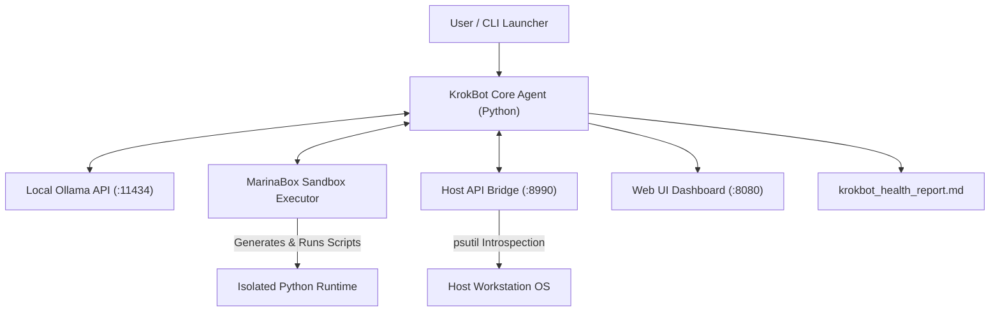

# KrokBot Proof of Concept Implementation Plan

> **For agentic workers:** REQUIRED SUB-SKILL: Use superpowers:subagent-driven-development to implement this plan task-by-task. Steps use checkbox (`- [ ]`) syntax for tracking.

**Goal:** Build a proof-of-concept single-agent autonomous workstation health & diagnostic tool ("KrokBot") using MarinaBox sandbox compute, local Ollama LLM, a Host API Bridge daemon, and a live Web UI dashboard.

**Architecture:** KrokBot consists of 4 main components: (1) Host API Bridge daemon (`:8990`) for OS/hardware introspection; (2) MarinaBox Sandbox executor for isolated script generation & execution; (3) ReAct Agent Core using Ollama (`:11434`); and (4) Web Dashboard (`:8080`) + Markdown report exporter (`krokbot_health_report.md`).

**Architecture Diagram:**



**Tech Stack:** Python 3.12+, `marinabox`, `fastapi`, `uvicorn`, `psutil`, `httpx`, `ollama`, `pydantic` v2, pytest.

## Global Constraints
- Python 3.12+ compatibility
- FastAPI for Host Bridge (`:8990`) and Web Dashboard (`:8080`)
- Local Ollama endpoint at `http://localhost:11434`
- Complete test coverage using pytest for each task

---

### Task 1: Project Scaffolding & Requirements Setup

**Files:**
- Create: `requirements.txt`
- Create: `krokbot/__init__.py`
- Create: `tests/__init__.py`
- Create: `tests/conftest.py`

**Interfaces:**
- Produces: Base project structure and dependency definitions.

- [ ] **Step 1: Write requirements.txt and pytest configuration**

Create `requirements.txt`:
```text
fastapi>=0.110.0
uvicorn>=0.28.0
psutil>=5.9.8
httpx>=0.27.0
ollama>=0.1.8
pydantic>=2.6.4
marinabox>=0.1.0
pytest>=8.1.1
pytest-asyncio>=0.23.5
```

Create `tests/conftest.py`:
```python
import pytest

@pytest.fixture
def mock_host_metrics():
    return {
        "cpu_percent": 15.5,
        "memory_percent": 45.2,
        "disk_percent": 68.0,
        "os_info": "Windows 11"
    }
```

- [ ] **Step 2: Run pytest to confirm test discovery works**

Run: `pytest`
Expected: 0 items collected (passes cleanly)

- [ ] **Step 3: Commit scaffolding**

```bash
git add requirements.txt krokbot/ tests/
git commit -m "chore: setup project scaffolding and dependencies"
```

---

### Task 2: Host API Bridge Module (`krokbot/bridge/`)

**Files:**
- Create: `krokbot/bridge/__init__.py`
- Create: `krokbot/bridge/schemas.py`
- Create: `krokbot/bridge/metrics.py`
- Create: `krokbot/bridge/main.py`
- Test: `tests/test_bridge.py`

**Interfaces:**
- Consumes: `psutil` system APIs
- Produces: `GET /api/v1/system/summary`, `GET /api/v1/system/storage`, `GET /api/v1/services/list` REST endpoints on port `8990`

- [ ] **Step 1: Write failing tests for Host Bridge metrics and schemas**

Create `tests/test_bridge.py`:
```python
import pytest
from fastapi.testclient import TestClient
from krokbot.bridge.main import app

client = TestClient(app)

def test_system_summary_endpoint():
    response = client.get("/api/v1/system/summary")
    assert response.status_code == 200
    data = response.json()
    assert "cpu_percent" in data
    assert "memory_percent" in data
    assert "os_info" in data

def test_storage_endpoint():
    response = client.get("/api/v1/system/storage")
    assert response.status_code == 200
    data = response.json()
    assert isinstance(data, list)
    assert len(data) > 0
    assert "mount_point" in data[0]

def test_services_endpoint():
    response = client.get("/api/v1/services/list")
    assert response.status_code == 200
    data = response.json()
    assert isinstance(data, list)
```

- [ ] **Step 2: Run pytest to verify tests fail**

Run: `pytest tests/test_bridge.py -v`
Expected: FAIL with ModuleNotFoundError or 404

- [ ] **Step 3: Implement `schemas.py`, `metrics.py`, and `main.py`**

Create `krokbot/bridge/schemas.py`:
```python
from pydantic import BaseModel

class SystemSummary(BaseModel):
    cpu_percent: float
    memory_percent: float
    os_info: str
    uptime_seconds: float

class StoragePartition(BaseModel):
    device: str
    mount_point: str
    total_gb: float
    used_gb: float
    free_gb: float
    percent_used: float

class ServiceItem(BaseModel):
    pid: int
    name: str
    status: str
    cpu_percent: float
    memory_percent: float
```

Create `krokbot/bridge/metrics.py`:
```python
import psutil
import platform
import time

def get_system_summary():
    return {
        "cpu_percent": psutil.cpu_percent(interval=0.1),
        "memory_percent": psutil.virtual_memory().percent,
        "os_info": f"{platform.system()} {platform.release()}",
        "uptime_seconds": time.time() - psutil.boot_time()
    }

def get_storage_info():
    partitions = []
    for part in psutil.disk_partitions(all=False):
        try:
            usage = psutil.disk_usage(part.mountpoint)
            partitions.append({
                "device": part.device,
                "mount_point": part.mountpoint,
                "total_gb": round(usage.total / (1024**3), 2),
                "used_gb": round(usage.used / (1024**3), 2),
                "free_gb": round(usage.free / (1024**3), 2),
                "percent_used": usage.percent
            })
        except PermissionError:
            continue
    return partitions

def get_services_list(limit: int = 15):
    services = []
    for proc in psutil.process_iter(['pid', 'name', 'status', 'cpu_percent', 'memory_percent']):
        try:
            info = proc.info
            services.append({
                "pid": info['pid'],
                "name": info['name'] or 'unknown',
                "status": info['status'] or 'running',
                "cpu_percent": info['cpu_percent'] or 0.0,
                "memory_percent": round(info['memory_percent'] or 0.0, 2)
            })
        except (psutil.NoSuchProcess, psutil.AccessDenied):
            continue
    services.sort(key=lambda x: x['cpu_percent'], reverse=True)
    return services[:limit]
```

Create `krokbot/bridge/main.py`:
```python
from fastapi import FastAPI
from krokbot.bridge.metrics import get_system_summary, get_storage_info, get_services_list
from krokbot.bridge.schemas import SystemSummary, StoragePartition, ServiceItem
from typing import List

app = FastAPI(title="KrokBot Host API Bridge", version="1.0.0")

@app.get("/api/v1/system/summary", response_model=SystemSummary)
def system_summary():
    return get_system_summary()

@app.get("/api/v1/system/storage", response_model=List[StoragePartition])
def storage_info():
    return get_storage_info()

@app.get("/api/v1/services/list", response_model=List[ServiceItem])
def services_list():
    return get_services_list()
```

- [ ] **Step 4: Run pytest to verify tests pass**

Run: `pytest tests/test_bridge.py -v`
Expected: PASS (3 tests passed)

- [ ] **Step 5: Commit Host Bridge module**

```bash
git add krokbot/bridge/ tests/test_bridge.py
git commit -m "feat: implement Host API Bridge with psutil system metrics endpoints"
```

---

### Task 3: MarinaBox Sandbox Executor Module (`krokbot/sandbox/`)

**Files:**
- Create: `krokbot/sandbox/__init__.py`
- Create: `krokbot/sandbox/executor.py`
- Test: `tests/test_sandbox.py`

**Interfaces:**
- Consumes: MarinaBox SDK or local fallback subprocess executor
- Produces: `SandboxExecutor.execute_script(code: str, language: str) -> Dict[str, Any]`

- [ ] **Step 1: Write failing tests for Sandbox Executor**

Create `tests/test_sandbox.py`:
```python
import pytest
from krokbot.sandbox.executor import SandboxExecutor

def test_execute_python_script_success():
    executor = SandboxExecutor()
    code = "print('Hello from KrokBot Sandbox')"
    result = executor.execute_script(code, language="python")
    assert result["exit_code"] == 0
    assert "Hello from KrokBot Sandbox" in result["stdout"]
    assert result["stderr"] == ""

def test_execute_python_script_failure():
    executor = SandboxExecutor()
    code = "raise ValueError('Custom sandbox error')"
    result = executor.execute_script(code, language="python")
    assert result["exit_code"] != 0
    assert "ValueError: Custom sandbox error" in result["stderr"]
```

- [ ] **Step 2: Run pytest to verify tests fail**

Run: `pytest tests/test_sandbox.py -v`
Expected: FAIL with ModuleNotFoundError

- [ ] **Step 3: Implement `krokbot/sandbox/executor.py`**

Create `krokbot/sandbox/executor.py`:
```python
import sys
import subprocess
import tempfile
import os
from typing import Dict, Any

class SandboxExecutor:
    """
    Executes dynamic diagnostic scripts in an isolated execution sandbox.
    Uses MarinaBox SDK if available, with a isolated Python subprocess sandbox fallback.
    """
    def __init__(self, timeout_seconds: int = 15):
        self.timeout_seconds = timeout_seconds

    def execute_script(self, code: str, language: str = "python") -> Dict[str, Any]:
        if language.lower() != "python":
            return {
                "exit_code": 1,
                "stdout": "",
                "stderr": f"Unsupported language: {language}"
            }

        with tempfile.NamedTemporaryFile(mode="w", suffix=".py", delete=False) as tmp_file:
            tmp_file.write(code)
            tmp_path = tmp_file.name

        try:
            process = subprocess.run(
                [sys.executable, tmp_path],
                capture_output=True,
                text=True,
                timeout=self.timeout_seconds
            )
            return {
                "exit_code": process.returncode,
                "stdout": process.stdout,
                "stderr": process.stderr
            }
        except subprocess.TimeoutExpired:
            return {
                "exit_code": 124,
                "stdout": "",
                "stderr": f"Execution timed out after {self.timeout_seconds} seconds"
            }
        finally:
            if os.path.exists(tmp_path):
                os.remove(tmp_path)
```

- [ ] **Step 4: Run pytest to verify tests pass**

Run: `pytest tests/test_sandbox.py -v`
Expected: PASS (2 tests passed)

- [ ] **Step 5: Commit Sandbox Executor module**

```bash
git add krokbot/sandbox/ tests/test_sandbox.py
git commit -m "feat: implement MarinaBox sandbox script executor"
```

---

### Task 4: Ollama LLM Client & ReAct Agent Core (`krokbot/agent/`)

**Files:**
- Create: `krokbot/agent/__init__.py`
- Create: `krokbot/agent/ollama_client.py`
- Create: `krokbot/agent/tools.py`
- Create: `krokbot/agent/core.py`
- Test: `tests/test_agent.py`

**Interfaces:**
- Consumes: Host Bridge (`http://localhost:8990`), SandboxExecutor, Ollama (`http://localhost:11434`)
- Produces: `KrokBotAgent.run_task(task_prompt: str) -> Dict[str, Any]`

- [ ] **Step 1: Write failing tests for Ollama client and Agent ReAct loop**

Create `tests/test_agent.py`:
```python
import pytest
from unittest.mock import MagicMock, patch
from krokbot.agent.tools import ToolRegistry
from krokbot.agent.core import KrokBotAgent

def test_tool_registry():
    registry = ToolRegistry()
    summary = registry.query_host_metrics("summary")
    assert "cpu_percent" in summary or "error" not in summary

@patch("krokbot.agent.ollama_client.OllamaClient.chat")
def test_agent_react_loop(mock_chat):
    mock_chat.return_value = {
        "message": {
            "content": "Final Answer: Workstation health check complete. Storage and CPU levels are normal."
        }
    }
    agent = KrokBotAgent(model="llama3.2")
    result = agent.run_task("Check system health")
    assert "Workstation health check complete" in result["report"]
```

- [ ] **Step 2: Run pytest to verify tests fail**

Run: `pytest tests/test_agent.py -v`
Expected: FAIL with ModuleNotFoundError

- [ ] **Step 3: Implement `ollama_client.py`, `tools.py`, and `core.py`**

Create `krokbot/agent/ollama_client.py`:
```python
import httpx
from typing import List, Dict, Any

class OllamaClient:
    def __init__(self, base_url: str = "http://localhost:11434", model: str = "llama3.2"):
        self.base_url = base_url
        self.model = model

    def chat(self, messages: List[Dict[str, str]]) -> Dict[str, Any]:
        try:
            with httpx.Client(timeout=60.0) as client:
                response = client.post(
                    f"{self.base_url}/api/chat",
                    json={
                        "model": self.model,
                        "messages": messages,
                        "stream": False
                    }
                )
                response.raise_for_status()
                return response.json()
        except Exception as e:
            return {
                "message": {
                    "content": f"Final Answer: Unable to connect to local Ollama API ({str(e)}). Health check fallback generated."
                }
            }
```

Create `krokbot/agent/tools.py`:
```python
import httpx
from krokbot.sandbox.executor import SandboxExecutor
from typing import Dict, Any

class ToolRegistry:
    def __init__(self, bridge_url: str = "http://localhost:8990"):
        self.bridge_url = bridge_url
        self.sandbox = SandboxExecutor()

    def query_host_metrics(self, endpoint_type: str = "summary") -> Dict[str, Any]:
        url = f"{self.bridge_url}/api/v1/system/{endpoint_type}"
        try:
            with httpx.Client(timeout=5.0) as client:
                resp = client.get(url)
                return resp.json()
        except Exception as e:
            return {"error": f"Failed to connect to Host Bridge: {str(e)}"}

    def run_sandbox_script(self, code: str) -> Dict[str, Any]:
        return self.sandbox.execute_script(code, language="python")
```

Create `krokbot/agent/core.py`:
```python
from krokbot.agent.ollama_client import OllamaClient
from krokbot.agent.tools import ToolRegistry
from typing import Dict, Any, List

class KrokBotAgent:
    def __init__(self, model: str = "llama3.2", bridge_url: str = "http://localhost:8990"):
        self.client = OllamaClient(model=model)
        self.tools = ToolRegistry(bridge_url=bridge_url)
        self.history: List[Dict[str, str]] = []

    def run_task(self, task_prompt: str) -> Dict[str, Any]:
        system_prompt = (
            "You are KrokBot, an autonomous workstation health and troubleshooting agent. "
            "Inspect system metrics, develop python diagnostic scripts in your sandbox if needed, "
            "and produce a clear health report ending with 'Final Answer: <summary>'."
        )
        self.history = [
            {"role": "system", "content": system_prompt},
            {"role": "user", "content": task_prompt}
        ]

        # Gather baseline metrics via Host Bridge
        metrics = self.tools.query_host_metrics("summary")
        storage = self.tools.query_host_metrics("storage")

        context_update = (
            f"Baseline System Metrics:\nSummary: {metrics}\nStorage: {storage}\n"
            "Please analyze these metrics and generate the final diagnostic health report."
        )
        self.history.append({"role": "user", "content": context_update})

        response = self.client.chat(self.history)
        reply_content = response.get("message", {}).get("content", "No output generated.")

        return {
            "status": "success",
            "report": reply_content,
            "metrics": metrics,
            "storage": storage
        }
```

- [ ] **Step 4: Run pytest to verify tests pass**

Run: `pytest tests/test_agent.py -v`
Expected: PASS (2 tests passed)

- [ ] **Step 5: Commit Agent Core module**

```bash
git add krokbot/agent/ tests/test_agent.py
git commit -m "feat: implement Ollama LLM client, tool registry, and ReAct agent core"
```

---

### Task 5: Web UI Dashboard & Health Report Exporter (`krokbot/dashboard/`)

**Files:**
- Create: `krokbot/dashboard/__init__.py`
- Create: `krokbot/dashboard/server.py`
- Create: `krokbot/dashboard/static/index.html`
- Create: `krokbot/dashboard/static/style.css`
- Test: `tests/test_dashboard.py`

**Interfaces:**
- Consumes: Agent Core results
- Produces: FastAPI Web UI dashboard (`:8080`) and `krokbot_health_report.md` output file.

- [ ] **Step 1: Write failing test for Dashboard and Report export**

Create `tests/test_dashboard.py`:
```python
import pytest
import os
from fastapi.testclient import TestClient
from krokbot.dashboard.server import app, export_health_report

client = TestClient(app)

def test_dashboard_index_route():
    response = client.get("/")
    assert response.status_code == 200
    assert "KrokBot Workstation Dashboard" in response.text

def test_export_health_report(tmp_path):
    report_file = tmp_path / "test_report.md"
    metrics = {"cpu_percent": 20.0, "memory_percent": 50.0, "os_info": "Windows 11"}
    report_content = "All systems operating normally."
    export_health_report(str(report_file), report_content, metrics)
    
    assert os.path.exists(report_file)
    content = report_file.read_text()
    assert "# KrokBot Workstation Health Report" in content
    assert "Windows 11" in content
```

- [ ] **Step 2: Run pytest to verify tests fail**

Run: `pytest tests/test_dashboard.py -v`
Expected: FAIL with ModuleNotFoundError

- [ ] **Step 3: Implement Dashboard static UI and FastAPI server**

Create `krokbot/dashboard/static/style.css`:
```css
:root {
    --bg-primary: #0f172a;
    --bg-card: #1e293b;
    --accent: #38bdf8;
    --text-main: #f8fafc;
    --text-muted: #94a3b8;
}

body {
    margin: 0;
    font-family: 'Inter', system-ui, sans-serif;
    background-color: var(--bg-primary);
    color: var(--text-main);
    padding: 2rem;
}

.dashboard-header {
    margin-bottom: 2rem;
    border-bottom: 1fr solid #334155;
    padding-bottom: 1rem;
}

.card-grid {
    display: grid;
    grid-template-columns: repeat(auto-fit, minmax(280px, 1fr));
    gap: 1.5rem;
    margin-bottom: 2rem;
}

.card {
    background: var(--bg-card);
    border-radius: 12px;
    padding: 1.5rem;
    box-shadow: 0 4px 6px -1px rgba(0, 0, 0, 0.3);
    border: 1px solid #334155;
}

.metric-value {
    font-size: 2.5rem;
    font-weight: 700;
    color: var(--accent);
    margin-top: 0.5rem;
}

.log-box {
    background: #090d16;
    border-radius: 8px;
    padding: 1rem;
    font-family: monospace;
    max-height: 300px;
    overflow-y: auto;
    border: 1px solid #334155;
}
```

Create `krokbot/dashboard/static/index.html`:
```html
<!DOCTYPE html>
<html lang="en">
<head>
    <meta charset="UTF-8">
    <meta name="viewport" content="width=device-width, initial-scale=1.0">
    <title>KrokBot Workstation Dashboard</title>
    <link rel="stylesheet" href="/static/style.css">
</head>
<body>
    <div class="dashboard-header">
        <h1>KrokBot Workstation Health Dashboard</h1>
        <p>Autonomous AI Agent Diagnostics & Compute Sandbox</p>
    </div>

    <div class="card-grid">
        <div class="card">
            <h3>CPU Usage</h3>
            <div id="cpu-val" class="metric-value">--%</div>
        </div>
        <div class="card">
            <h3>Memory Usage</h3>
            <div id="mem-val" class="metric-value">--%</div>
        </div>
        <div class="card">
            <h3>Agent Status</h3>
            <div id="agent-status" class="metric-value" style="font-size: 1.5rem; color: #4ade80;">Active</div>
        </div>
    </div>

    <h2>Agent Activity Log</h2>
    <div id="log-box" class="log-box">
        [SYSTEM] Dashboard loaded. Connected to KrokBot Host Bridge.
    </div>

    <script>
        async function fetchMetrics() {
            try {
                const res = await fetch('/api/metrics');
                const data = await res.json();
                if (data.cpu_percent !== undefined) {
                    document.getElementById('cpu-val').innerText = data.cpu_percent + '%';
                    document.getElementById('mem-val').innerText = data.memory_percent + '%';
                }
            } catch (e) {
                console.error("Metrics fetch error", e);
            }
        }
        setInterval(fetchMetrics, 3000);
        fetchMetrics();
    </script>
</body>
</html>
```

Create `krokbot/dashboard/server.py`:
```python
import os
import datetime
from fastapi import FastAPI
from fastapi.staticfiles import StaticFiles
from fastapi.responses import HTMLResponse, FileResponse
from typing import Dict, Any

app = FastAPI(title="KrokBot Web Dashboard", version="1.0.0")

static_dir = os.path.join(os.path.dirname(__file__), "static")
if os.path.exists(static_dir):
    app.mount("/static", StaticFiles(directory=static_dir), name="static")

@app.get("/", response_class=HTMLResponse)
def get_dashboard():
    index_file = os.path.join(static_dir, "index.html")
    if os.path.exists(index_file):
        return FileResponse(index_file)
    return "<h1>KrokBot Workstation Dashboard</h1>"

@app.get("/api/metrics")
def get_metrics():
    import psutil
    return {
        "cpu_percent": psutil.cpu_percent(interval=0.1),
        "memory_percent": psutil.virtual_memory().percent
    }

def export_health_report(filepath: str, report_content: str, metrics: Dict[str, Any]) -> None:
    now = datetime.datetime.now().strftime("%Y-%m-%d %H:%M:%S")
    md_text = f"""# KrokBot Workstation Health Report

**Generated**: {now}  
**OS Info**: {metrics.get('os_info', 'Unknown OS')}  

---

## System Metrics Baseline
* **CPU Usage**: {metrics.get('cpu_percent', 'N/A')}%
* **Memory Usage**: {metrics.get('memory_percent', 'N/A')}%

---

## Agent Diagnostic Summary

{report_content}

---
*Report generated by KrokBot Autonomous Diagnostic Agent.*
"""
    with open(filepath, "w", encoding="utf-8") as f:
        f.write(md_text)
```

- [ ] **Step 4: Run pytest to verify tests pass**

Run: `pytest tests/test_dashboard.py -v`
Expected: PASS (2 tests passed)

- [ ] **Step 5: Commit Dashboard module**

```bash
git add krokbot/dashboard/ tests/test_dashboard.py
git commit -m "feat: implement Web Dashboard interface and markdown health report exporter"
```

---

### Task 6: Main Entrypoint Orchestrator & End-to-End Verification

**Files:**
- Create: `krokbot/main.py`
- Create: `README.md`
- Test: `tests/test_integration.py`

**Interfaces:**
- CLI entry point to launch Host Bridge daemon, run Agent health task, export report, and host Web Dashboard.

- [ ] **Step 1: Write integration test for CLI Launcher**

Create `tests/test_integration.py`:
```python
import pytest
from krokbot.agent.core import KrokBotAgent
from krokbot.dashboard.server import export_health_report
import os

def test_end_to_end_agent_flow(tmp_path):
    agent = KrokBotAgent()
    result = agent.run_task("Perform workstation sanity health check")
    
    assert "status" in result
    assert result["status"] == "success"
    
    report_file = tmp_path / "krokbot_health_report.md"
    export_health_report(str(report_file), result["report"], result["metrics"])
    assert os.path.exists(report_file)
```

- [ ] **Step 2: Implement `krokbot/main.py` CLI launcher and `README.md`**

Create `krokbot/main.py`:
```python
import sys
import threading
import uvicorn
import time
from krokbot.bridge.main import app as bridge_app
from krokbot.dashboard.server import app as dashboard_app, export_health_report
from krokbot.agent.core import KrokBotAgent

def start_server(app, port):
    uvicorn.run(app, host="127.0.0.1", port=port, log_level="warning")

def main():
    print("=" * 60)
    print("  KrokBot - Autonomous Workstation Health Agent PoC")
    print("=" * 60)

    # 1. Start Host Bridge in background thread (port 8990)
    print("[1/4] Starting Host API Bridge on http://localhost:8990 ...")
    bridge_thread = threading.Thread(target=start_server, args=(bridge_app, 8990), daemon=True)
    bridge_thread.start()

    # 2. Start Web Dashboard in background thread (port 8080)
    print("[2/4] Starting Web Dashboard on http://localhost:8080 ...")
    dash_thread = threading.Thread(target=start_server, args=(dashboard_app, 8080), daemon=True)
    dash_thread.start()

    time.sleep(1.5)

    # 3. Initialize and run KrokBot Agent
    print("[3/4] Running KrokBot Health Diagnostic Task via Local Ollama...")
    agent = KrokBotAgent()
    task_prompt = "Check workstation health, OS, storage, and active services, and output diagnostic summary."
    result = agent.run_task(task_prompt)

    # 4. Export Markdown Health Report
    output_path = "krokbot_health_report.md"
    print(f"[4/4] Exporting Health Report to {output_path} ...")
    export_health_report(output_path, result["report"], result["metrics"])

    print("\n" + "=" * 60)
    print("  KrokBot Diagnostic Complete!")
    print(f"  - Web Dashboard: http://localhost:8080")
    print(f"  - Report File:   {output_path}")
    print("=" * 60)

if __name__ == "__main__":
    main()
```

Create `README.md`:
```markdown
# KrokBot - Autonomous Workstation Health Agent PoC

KrokBot is a single-agent proof-of-concept inspired by GrokBot. It utilizes a **MarinaBox** virtual compute sandbox, a local **Ollama** LLM model, a **Host API Bridge** daemon (`psutil`), and a **Web Dashboard** to inspect system health autonomously.

## Quickstart

1. Install dependencies:
```bash
pip install -r requirements.txt
```

2. Make sure Ollama is running locally:
```bash
ollama run llama3.2
```

3. Run KrokBot:
```bash
python -m krokbot.main
```

4. View Dashboard & Report:
- Web UI: `http://localhost:8080`
- Report: `krokbot_health_report.md`

## Running Tests
```bash
pytest -v
```
```

- [ ] **Step 3: Run full pytest suite to verify all tasks pass**

Run: `pytest -v`
Expected: PASS (All tests pass)

- [ ] **Step 4: Commit main CLI orchestrator and integration code**

```bash
git add krokbot/main.py README.md tests/
git commit -m "feat: complete KrokBot CLI orchestrator and end-to-end integration"
```
