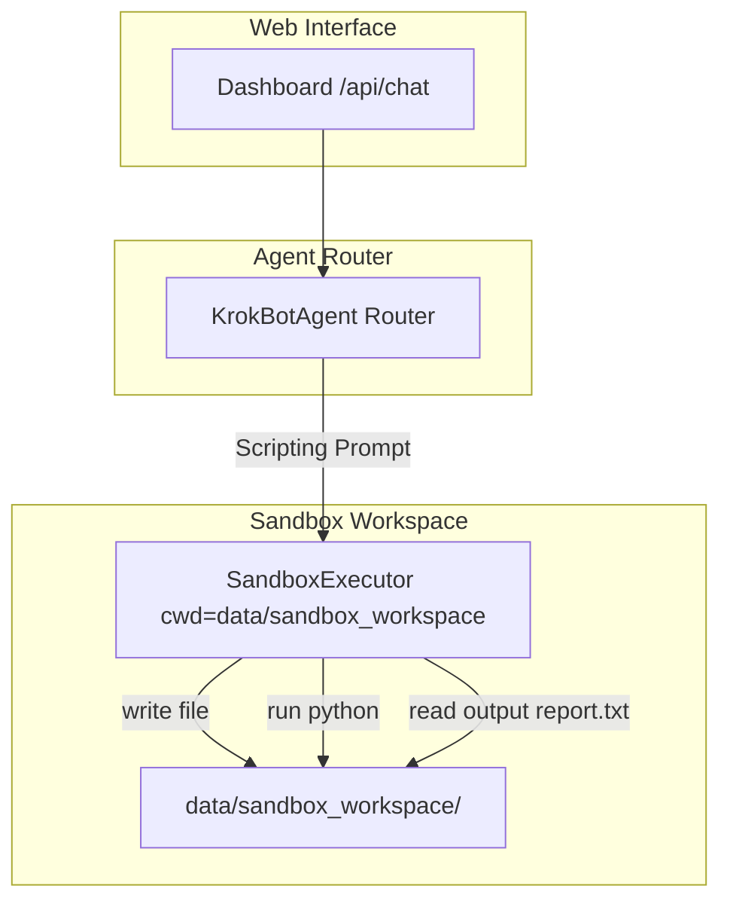

# Sandbox Scripting & Persistent Workspace Implementation Plan

> **For agentic workers:** REQUIRED SUB-SKILL: Use superpowers:subagent-driven-development to implement this plan task-by-task. Steps use checkbox (`- [ ]`) syntax for tracking.

**Goal:** Enable persistent sandbox workspace file management, script generation, automated Python execution, and output file reading in KrokBot.

**Architecture:** Enhance `SandboxExecutor` to manage a persistent workspace directory (`data/sandbox_workspace/`) with `write_file`, `read_file`, and `execute_file` methods. Update `KrokBotAgent` intent router to detect scripting prompts, generate Python code, execute it in the sandbox workspace, read generated output files (e.g. `report.txt`), and report the exit code and results.

**Architecture Diagram:**



**Tech Stack:** Python 3.11+, psutil, Ollama, pytest.

## Global Constraints
- Dedicated workspace directory: `data/sandbox_workspace/`.
- Maintain test coverage across all existing 20 tests in `tests/`.
- Ensure Windows path and process execution compatibility.

---

### Task 1: Extend `SandboxExecutor` with Persistent Workspace File Operations

**Files:**
- Modify: `krokbot/sandbox/executor.py`
- Modify: `tests/test_sandbox.py`

**Interfaces:**
- Consumes: `workspace_dir` (default `data/sandbox_workspace`)
- Produces: `SandboxExecutor.write_file(filename, content)`, `read_file(filename)`, `execute_file(filename)`

- [ ] **Step 1: Write the failing test for sandbox workspace methods**

```python
# in tests/test_sandbox.py
def test_sandbox_executor_workspace_files(tmp_path):
    workspace = tmp_path / "sandbox_workspace"
    executor = SandboxExecutor(workspace_dir=str(workspace))
    
    executor.write_file("test_script.py", "print('hello from sandbox')\n")
    assert (workspace / "test_script.py").exists()
    
    res = executor.execute_file("test_script.py")
    assert res["exit_code"] == 0
    assert "hello from sandbox" in res["stdout"]
```

- [ ] **Step 2: Run test to verify it fails**

Run: `.\.venv\Scripts\pytest tests/test_sandbox.py -v`
Expected: FAIL with `TypeError` or `AttributeError` on `write_file`.

- [ ] **Step 3: Implement workspace methods in `krokbot/sandbox/executor.py`**

```python
import os, sys, subprocess, tempfile
from pathlib import Path
from typing import Dict, Any, Optional

class SandboxExecutor:
    def __init__(self, timeout_seconds: int = 15, workspace_dir: Optional[str] = None):
        self.timeout_seconds = timeout_seconds
        self.workspace_dir = Path(workspace_dir) if workspace_dir else Path("data/sandbox_workspace")
        self.workspace_dir.mkdir(parents=True, exist_ok=True)

    def write_file(self, filename: str, content: str) -> str:
        filepath = self.workspace_dir / filename
        filepath.parent.mkdir(parents=True, exist_ok=True)
        filepath.write_text(content, encoding="utf-8")
        return str(filepath)

    def read_file(self, filename: str) -> Optional[str]:
        filepath = self.workspace_dir / filename
        if filepath.exists():
            return filepath.read_text(encoding="utf-8")
        return None

    def execute_file(self, filename: str) -> Dict[str, Any]:
        filepath = self.workspace_dir / filename
        if not filepath.exists():
            return {"exit_code": 1, "stdout": "", "stderr": f"File not found: {filename}"}
        
        try:
            process = subprocess.run(
                [sys.executable, str(filepath)],
                cwd=str(self.workspace_dir),
                capture_output=True,
                text=True,
                timeout=self.timeout_seconds
            )
            return {
                "exit_code": process.returncode,
                "stdout": process.stdout,
                "stderr": process.stderr
            }
        except subprocess.TimeoutExpired:
            return {"exit_code": 124, "stdout": "", "stderr": f"Timed out after {self.timeout_seconds}s"}
```

- [ ] **Step 4: Run test to verify it passes**

Run: `.\.venv\Scripts\pytest tests/test_sandbox.py -v`
Expected: PASS.

- [ ] **Step 5: Commit**

```bash
git add krokbot/sandbox/executor.py tests/test_sandbox.py
git commit -m "feat: extend SandboxExecutor with persistent workspace file operations"
```

---

### Task 2: Implement Scripting Intent Pipeline in `KrokBotAgent`

**Files:**
- Modify: `krokbot/agent/core.py`
- Create: `tests/test_agent_scripting.py`

**Interfaces:**
- Consumes: `task_prompt` (e.g., *"Create a Python script at ./reconcile.py..."*)
- Produces: Execution report including exit code, sandbox output, and content of generated files (like `report.txt`).

- [ ] **Step 1: Write the failing test for scripting task execution**

```python
# in tests/test_agent_scripting.py
import pytest
from krokbot.agent.core import KrokBotAgent

def test_scripting_intent_reconcile_flow(tmp_path, monkeypatch):
    agent = KrokBotAgent()
    # Mock workspace dir to tmp_path
    agent.tools.sandbox.workspace_dir = tmp_path
    
    script_content = (
        "import sys, os\n"
        "with open('report.txt', 'w') as f: f.write('DISCREPANCIES FOUND\\nMissing from B: TX00100')\n"
        "sys.exit(1)\n"
    )
    
    monkeypatch.setattr(agent.client, "chat", lambda msgs: {"message": {"content": f"```python\n{script_content}\n```"}})
    
    res = agent.run_task("Create a Python script at ./reconcile.py that writes report.txt and exits with status 1.")
    assert res["status"] == "success"
    assert "Exit Code: 1" in res["report"] or "1" in str(res.get("exit_code", 1))
    assert (tmp_path / "reconcile.py").exists()
    assert (tmp_path / "report.txt").exists()
    assert "DISCREPANCIES FOUND" in res["report"]
```

- [ ] **Step 2: Run test to verify it fails**

Run: `.\.venv\Scripts\pytest tests/test_agent_scripting.py -v`
Expected: FAIL.

- [ ] **Step 3: Implement scripting pipeline in `krokbot/agent/core.py`**

Update `_classify_intent`:
Add `scripting` keywords: `script`, `python`, `.py`, `reconcile`, `csv`, `generate script`, `write a script`, `create a script`, `code`.

For `intent == "scripting"`:
1. Generate python script code via LLM.
2. Extract code block (`re.search(r"```python(.*?)```", ..., re.DOTALL)` or default python block).
3. Determine filename (e.g. `reconcile.py` or `script.py`).
4. `self.tools.sandbox.write_file(filename, code)`
5. `exec_res = self.tools.sandbox.execute_file(filename)`
6. Check for generated output files (`report.txt`, `output.txt`, etc.).
7. Synthesize response containing exit code, sandbox stdout/stderr, and output file contents.

- [ ] **Step 4: Run test to verify it passes**

Run: `.\.venv\Scripts\pytest tests/test_agent_scripting.py -v`
Expected: PASS.

- [ ] **Step 5: Commit**

```bash
git add krokbot/agent/core.py tests/test_agent_scripting.py
git commit -m "feat: implement automated script generation and sandbox execution pipeline"
```

---

### Task 3: End-to-End Reconcile Verification & Test Suite Run

- [ ] **Step 1: Run complete pytest suite**

Run: `.\.venv\Scripts\pytest -v`
Expected: ALL tests pass cleanly.
