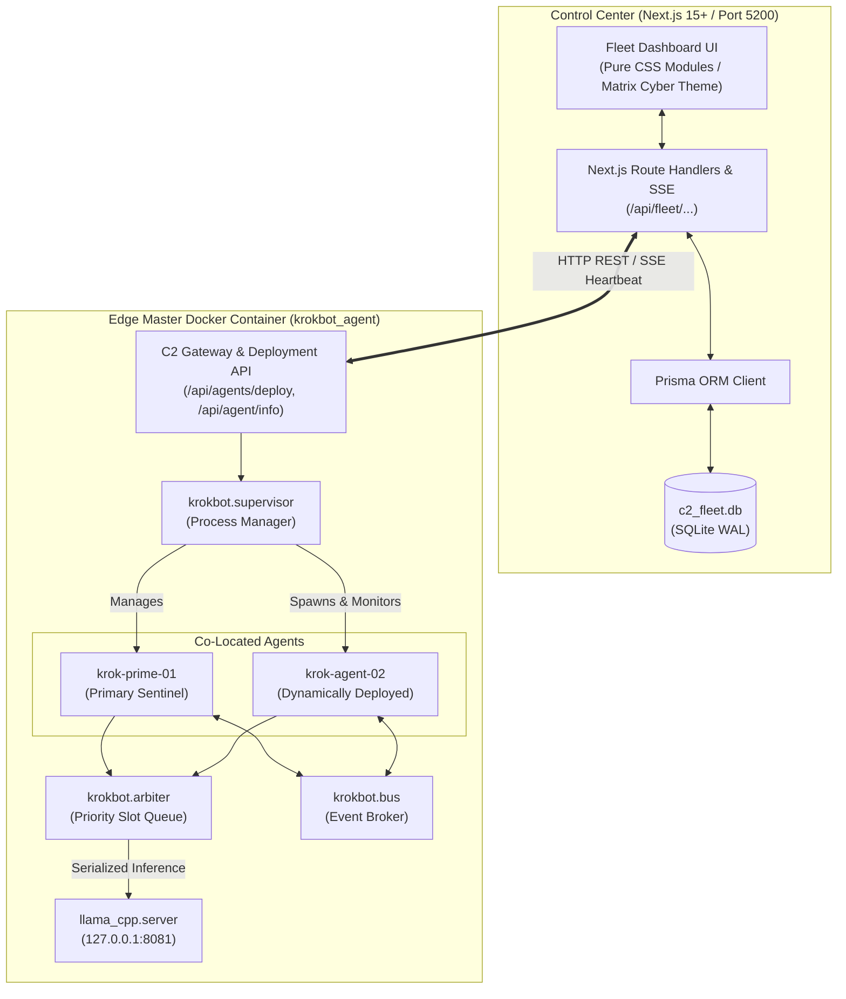

# KrokBot Fleet Control Center & Multi-Agent Edge Architecture Implementation Plan

> **For agentic workers:** REQUIRED SUB-SKILL: Use superpowers:subagent-driven-development to implement this plan task-by-task. Steps use checkbox (`- [ ]`) syntax for tracking.

**Goal:** Build and integrate the standalone Node.js / Next.js KrokBot Fleet Control Center (port 5200) with local SQLite database (Prisma) and equip the master KrokBot Docker container with an in-container Agent Supervisor, Shared Llama.cpp Inference Arbiter, and KrokBus Event Broker.

**Architecture:** The solution comprises two cooperating tiers: (1) An in-container multi-agent management subsystem inside `krokbot_agent` that isolates multiple uniform `KrokBotInstance` processes sharing one Llama.cpp GPU inference engine on port 8081 via an async priority arbiter, and (2) A standalone Next.js 15+ application (`control_center/`) running on port 5200 with Prisma SQLite (`c2_fleet.db`), REST/SSE gateway, and a cyber-industrial operations dashboard for fleet telemetry, agent deployment, and remote control.

**Architecture Diagram:**

**Tech Stack:** 
- Edge Container: Python 3.12, FastAPI, Uvicorn, Psutil, Llama.cpp, SQLite
- Control Center: Next.js 15+ (App Router, React 19, TypeScript), Node.js 22, Prisma ORM, SQLite WAL mode (`c2_fleet.db`), Pure CSS Modules (Cyber-Industrial Design System)

**Spec:** [`docs/superpowers/specs/2026-09-11-control-center-design.md`](file:///g:/antigravity_projects/krokbot/docs/superpowers/specs/2026-09-11-control-center-design.md)

## Global Constraints
- Control Center runs on port **5200** by default (`PORT=5200`).
- Local agent dashboard continues to run on port **5150**.
- Llama.cpp continues to run on port **8081** inside the container.
- All newly deployed agents are uniform `KrokBotInstance` units with their own isolated workspace directory (`/app/workspaces/<id>/`).
- Zero external database services (PostgreSQL/MySQL/Redis) — fully self-contained using SQLite in WAL mode.

---

### Task 1: In-Container Multi-Agent Supervisor & Deployment Endpoints

**Files:**
- Create: `krokbot/supervisor.py`
- Modify: `krokbot/dashboard/server.py`
- Test: `tests/test_supervisor.py`

**Interfaces:**
- `AgentSupervisor.spawn_agent(agent_id: str, agent_name: str, config_overrides: Optional[dict] = None) -> Dict[str, Any]`
- `AgentSupervisor.list_agents() -> List[Dict[str, Any]]`
- `AgentSupervisor.stop_agent(agent_id: str) -> bool`
- REST Endpoints:
  - `GET /api/agents`: Returns all active agent workers in the container.
  - `POST /api/agents/deploy`: Spawns a new uniform agent into the container.
  - `POST /api/agents/{agent_id}/stop`: Gracefully terminates an agent worker.

- [ ] **Step 1: Write failing tests in `tests/test_supervisor.py`**
- [ ] **Step 2: Run pytest to verify test fails**
- [ ] **Step 3: Implement `krokbot/supervisor.py` and register `/api/agents` endpoints in `krokbot/dashboard/server.py`**
- [ ] **Step 4: Run pytest to verify all tests pass**
- [ ] **Step 5: Commit changes**

---

### Task 2: Shared Inference Arbiter & KrokBus Event Broker

**Files:**
- Create: `krokbot/arbiter.py`
- Create: `krokbot/bus.py`
- Test: `tests/test_arbiter_and_bus.py`

**Interfaces:**
- `InferenceArbiter.enqueue(prompt_payload: dict, priority: int = 2) -> AsyncIterator[dict]`
- `KrokBus.publish(topic: str, payload: dict, source_agent: str) -> None`
- `KrokBus.subscribe(pattern: str, handler: Callable) -> str`

- [ ] **Step 1: Write tests for priority queueing in `tests/test_arbiter_and_bus.py`**
- [ ] **Step 2: Run pytest to verify test fails**
- [ ] **Step 3: Implement `krokbot/arbiter.py` and `krokbot/bus.py`**
- [ ] **Step 4: Run pytest to verify all tests pass**
- [ ] **Step 5: Commit changes**

---

### Task 3: Scaffold Next.js 15+ Control Center Application & Prisma SQLite

**Files:**
- Create: `control_center/package.json`
- Create: `control_center/tsconfig.json`
- Create: `control_center/next.config.mjs`
- Create: `control_center/prisma/schema.prisma`
- Create: `control_center/src/lib/prisma.ts`

**Interfaces:**
- Schema Models:
  - `model Node { id String @id, name String, ipAddress String, status String, activeModel String, hardwareInfo String, lastSeen DateTime, agents Agent[] }`
  - `model Agent { id String @id, nodeId String, name String, status String, port Int, toolPolicy String?, createdAt DateTime }`
  - `model Telemetry { id Int @id @default(autoincrement()), nodeId String, cpuPercent Float, memoryUsedGb Float, memoryPercent Float, timestamp DateTime }`
  - `model AuditLog { id Int @id @default(autoincrement()), nodeId String, agentId String, taskName String, status String, exitCode Int, durationMs Float, timestamp DateTime }`

- [ ] **Step 1: Initialize Next.js project structure in `control_center/` with TypeScript**
- [ ] **Step 2: Install dependencies (`prisma`, `@prisma/client`) and generate SQLite schema**
- [ ] **Step 3: Run `npx prisma db push` to create `c2_fleet.db` with WAL mode**
- [ ] **Step 4: Verify Prisma client builds and connects**
- [ ] **Step 5: Commit changes**

---

### Task 4: Control Center Fleet API Route Handlers & Edge Agent Controller

**Files:**
- Create: `control_center/src/lib/agent-client.ts`
- Create: `control_center/src/app/api/fleet/nodes/route.ts`
- Create: `control_center/src/app/api/fleet/nodes/[nodeId]/agents/route.ts`
- Create: `control_center/src/app/api/fleet/nodes/[nodeId]/deploy-agent/route.ts`
- Create: `control_center/src/app/api/fleet/nodes/[nodeId]/command/route.ts`
- Create: `control_center/src/app/api/fleet/telemetry/stream/route.ts`
- Test: `control_center/tests/api.test.ts` or standalone API test script

**Interfaces:**
- `GET /api/fleet/nodes`: Fetches all nodes and their co-located agents.
- `POST /api/fleet/nodes/[nodeId]/deploy-agent`: Proxies to edge container `POST /api/agents/deploy` and stores agent in Prisma DB.
- `POST /api/fleet/nodes/[nodeId]/command`: Proxies execution prompts, model switches, or script runs to specific edge agent.
- `GET /api/fleet/telemetry/stream`: SSE stream broadcasting live fleet vitals.

- [ ] **Step 1: Implement `agent-client.ts` for talking to edge agent APIs**
- [ ] **Step 2: Implement route handlers for nodes, agents, deployment, and command proxying**
- [ ] **Step 3: Implement SSE telemetry broadcast endpoint**
- [ ] **Step 4: Test API routes with mock node and live node**
- [ ] **Step 5: Commit changes**

---

### Task 5: Cyber-Industrial Fleet Dashboard UI (Next.js App Router)

**Files:**
- Create: `control_center/src/app/layout.tsx`
- Create: `control_center/src/app/page.tsx`
- Create: `control_center/src/app/globals.css`
- Create: `control_center/src/components/FleetHeader.tsx`
- Create: `control_center/src/components/NodeCard.tsx`
- Create: `control_center/src/components/DeployAgentModal.tsx`
- Create: `control_center/src/components/ModelManagerPanel.tsx`
- Create: `control_center/src/components/LiveAuditStream.tsx`
- Create: `control_center/src/components/TerminalDrawer.tsx`

**Design & UI Requirements:**
- Cyber-industrial aesthetics: Matrix Phosphor (`#00ff66`), Amber CRT (`#ffb000`), Dark Graphite (`#0a0f0d`), and Slate Industrial.
- Live updating metrics (CPU %, RAM, storage, Llama.cpp online badge).
- `[+ Deploy New Agent]` interactive modal with instant feedback.
- Interactive terminal drawer to send direct commands to any agent across the fleet.

- [ ] **Step 1: Create global CSS tokens, typography, and layout matching KrokBot theme**
- [ ] **Step 2: Build FleetHeader, NodeCard grid, and Agent status badges**
- [ ] **Step 3: Implement DeployAgentModal with validation and real-time feedback**
- [ ] **Step 4: Implement ModelManagerPanel and LiveAuditStream components**
- [ ] **Step 5: Connect real-time telemetry polling and SSE stream**
- [ ] **Step 6: Commit changes**

---

### Task 6: End-to-End Testing & Live Verification

**Files:**
- Create: `scripts/test_c2_e2e.py`
- Modify: `sync_docker.ps1` (to include supervisor and arbiter)

- [ ] **Step 1: Sync updated container code and restart `krokbot_agent`**
- [ ] **Step 2: Start Next.js Control Center on port 5200**
- [ ] **Step 3: Register local edge node (`http://localhost:5150`) into C2 database**
- [ ] **Step 4: Deploy a second agent (`krok-agent-02`) from the C2 dashboard into the container**
- [ ] **Step 5: Verify both agents run co-located, share Llama.cpp, and report to C2**
- [ ] **Step 6: Take browser screenshots of C2 dashboard on port 5200**
- [ ] **Step 7: Commit all code and push to `control_center` branch**
