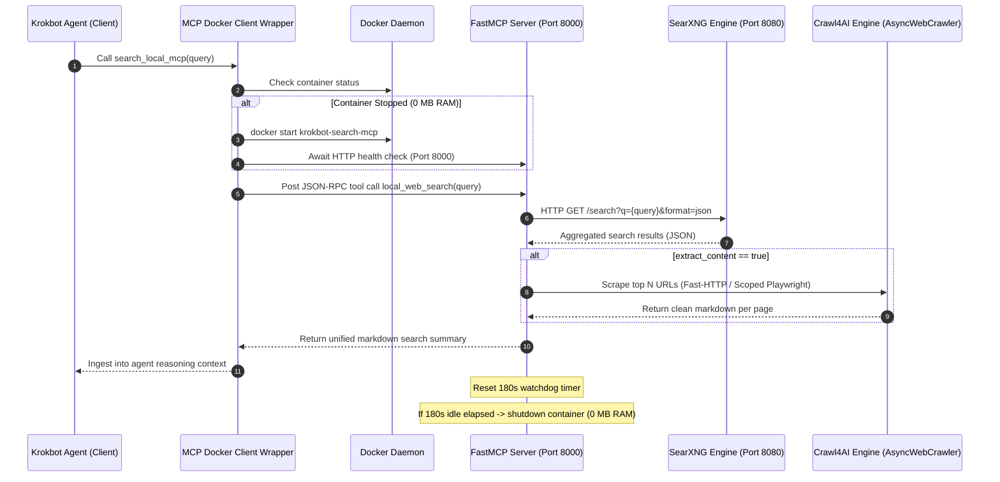

# Local SearXNG + Crawl4AI FastMCP Search Integration

> **For agentic workers:** REQUIRED SUB-SKILL: Use superpowers:subagent-driven-development to implement this plan task-by-task. Steps use checkbox (`- [ ]`) syntax for tracking.

**Goal:** Add a fully local, privacy-first internet search and markdown extraction toolchain to KrokBot using SearXNG, Crawl4AI, and FastMCP inside a lightweight Docker container with 0 MB idle memory overhead.

**Architecture:** A single Docker container (`krokbot-search-mcp`) packages SearXNG (meta-search engine on 127.0.0.1:8080), a FastMCP server (on 0.0.0.0:8000), and an idle watchdog. KrokBot invokes a client-side wrapper (`client/mcp_docker_wrapper.py`) that checks if the container is running, lazy-starts it on demand, relays the search and content extraction request, and allows the container's 180s idle watchdog to shut down when inactive.

**Architecture Diagram:**



**Tech Stack:**
* **Meta-Search:** SearXNG (lightweight, pruned engine configuration)
* **Web Scraping / Content Extraction:** Crawl4AI (`AsyncWebCrawler` with scoped Playwright Chromium) + `httpx`/`aiohttp`
* **Protocol:** Model Context Protocol (MCP) via `fastmcp` (Python 3.11)
* **Process Management:** `supervisord`
* **Client Integration:** Python Docker SDK / Subprocess wrapper + KrokBot Tool Governance Matrix

## Global Constraints

* Base container image must be `python:3.11-slim` with minimal package surface.
* Chromium instances inside Crawl4AI must strictly be scoped inside `async with` context managers to prevent orphaned browser processes.
* Idle RAM must drop to 0 MB after 180 seconds of inactivity by stopping the Docker container.
* All tools must adhere to KrokBot's Security Governance Matrix (`krokbot/config/tools_config.py`).
* Pass 100% of existing tests (80 pytest + 52 npm test).

---

### Task 1: Scaffolding Docker Container Configuration & SearXNG Setup

**Files:**
* Create: `docker/search-mcp/searxng/settings.yml`
* Create: `docker/search-mcp/supervisord.conf`
* Create: `docker/search-mcp/requirements.txt`
* Create: `docker/search-mcp/Dockerfile`
* Test: `tests/test_search_mcp_scaffold.py`

**Interfaces:**
* Produces: Container configuration files enabling SearXNG on `127.0.0.1:8080` and FastMCP on `0.0.0.0:8000`.

- [ ] **Step 1: Write test verifying container configuration files**

```python
# tests/test_search_mcp_scaffold.py
import os
import yaml
from pathlib import Path

def test_searxng_settings_configuration():
    settings_path = Path("docker/search-mcp/searxng/settings.yml")
    assert settings_path.exists(), "settings.yml must exist"
    with open(settings_path, "r", encoding="utf-8") as f:
        cfg = yaml.safe_load(f)
    assert "search" in cfg
    assert "json" in cfg["search"].get("formats", [])
    assert cfg.get("server", {}).get("port") == 8080
    assert cfg.get("server", {}).get("bind_address") in ("127.0.0.1", "0.0.0.0")

def test_dockerfile_and_supervisor_exist():
    assert Path("docker/search-mcp/Dockerfile").exists()
    assert Path("docker/search-mcp/supervisord.conf").exists()
    assert Path("docker/search-mcp/requirements.txt").exists()
```

- [ ] **Step 2: Run test to verify it fails**

Run: `pytest tests/test_search_mcp_scaffold.py -v`  
Expected: FAIL with missing files.

- [ ] **Step 3: Create `docker/search-mcp/searxng/settings.yml`**

```yaml
use_default_settings: true
general:
  debug: false
  instance_name: "KrokBot-LocalSearch"

server:
  port: 8080
  bind_address: "127.0.0.1"
  secret_key: "krokbot_search_mcp_secret_local_key"

search:
  safe_search: 0
  autocomplete: ""
  default_lang: "auto"
  formats:
    - html
    - json

engines:
  - name: google
    engine: google
    shortcut: go
    use_mobile_ui: false
  - name: duckduckgo
    engine: duckduckgo
    shortcut: ddg
  - name: bing
    engine: bing
    shortcut: bi
  - name: wikipedia
    engine: wikipedia
    shortcut: wp
  - name: github
    engine: github
    shortcut: gh
```

- [ ] **Step 4: Create `docker/search-mcp/requirements.txt`**

```text
fastmcp>=0.4.0
crawl4ai>=0.4.0
httpx>=0.27.0
aiohttp>=3.9.0
pyyaml>=6.0.1
supervisor>=4.2.5
playwright>=1.48.0
```

- [ ] **Step 5: Create `docker/search-mcp/supervisord.conf`**

```ini
[supervisord]
nodaemon=true
user=root
logfile=/var/log/supervisord.log
pidfile=/var/run/supervisord.pid

[program:searxng]
command=python3 -m searx.webapp
directory=/usr/local/searxng
environment=SEARXNG_SETTINGS_PATH="/etc/searxng/settings.yml"
autostart=true
autorestart=true
stdout_logfile=/var/log/searxng.log
stderr_logfile=/var/log/searxng_err.log

[program:mcp_server]
command=python3 /app/src/tools/search_mcp/mcp_server.py
directory=/app
autostart=true
autorestart=true
stdout_logfile=/var/log/mcp_server.log
stderr_logfile=/var/log/mcp_server_err.log

[program:watchdog]
command=python3 /app/src/tools/search_mcp/watchdog.py
directory=/app
autostart=true
autorestart=true
stdout_logfile=/var/log/watchdog.log
stderr_logfile=/var/log/watchdog_err.log
```

- [ ] **Step 6: Create `docker/search-mcp/Dockerfile`**

```dockerfile
FROM python:3.11-slim

WORKDIR /app

# Install system dependencies & Chromium dependencies for Playwright
RUN apt-get update && apt-get install -y --no-install-recommends \
    curl \
    git \
    supervisor \
    libnss3 \
    libnspr4 \
    libatk1.0-0 \
    libatk-bridge2.0-0 \
    libcups2 \
    libdrm2 \
    libxkbcommon0 \
    libxcomposite1 \
    libxdamage1 \
    libxfixes3 \
    libxrandr2 \
    libgbm1 \
    libpango-1.0-0 \
    libcairo2 \
    libasound2 \
    && rm -rf /var/lib/apt/lists/*

# Install SearXNG
RUN git clone https://github.com/searxng/searxng.git /usr/local/searxng && \
    pip install --no-cache-dir -e /usr/local/searxng

# Install Python requirements and Playwright browser
COPY docker/search-mcp/requirements.txt /app/requirements.txt
RUN pip install --no-cache-dir -r /app/requirements.txt && \
    playwright install chromium

# Copy configuration files
COPY docker/search-mcp/searxng/settings.yml /etc/searxng/settings.yml
COPY docker/search-mcp/supervisord.conf /etc/supervisor/conf.d/supervisord.conf

# Copy application source code
COPY src/ /app/src/

EXPOSE 8000

CMD ["/usr/bin/supervisord", "-c", "/etc/supervisor/conf.d/supervisord.conf"]
```

- [ ] **Step 7: Run test to verify it passes**

Run: `pytest tests/test_search_mcp_scaffold.py -v`  
Expected: PASS.

- [ ] **Step 8: Commit Task 1**

```bash
git add docker/ tests/test_search_mcp_scaffold.py
git commit -m "feat(search_mcp): scaffold docker container and searxng configurations"
```

---

### Task 2: Implement Crawl4AI Content Extractor & Watchdog Daemon

**Files:**
* Create: `src/tools/search_mcp/crawler_service.py`
* Create: `src/tools/search_mcp/watchdog.py`
* Test: `tests/test_crawler_and_watchdog.py`

**Interfaces:**
* `CrawlerService.extract(urls: List[str]) -> Dict[str, str]`: Extracts clean markdown per URL.
* `Watchdog`: Manages `touch_activity()` and triggers exit on 180s inactivity.

- [ ] **Step 1: Write test for CrawlerService and Watchdog**

```python
# tests/test_crawler_and_watchdog.py
import pytest
import time
import os
from unittest.mock import patch, AsyncMock
from src.tools.search_mcp.crawler_service import CrawlerService
from src.tools.search_mcp.watchdog import WatchdogState

@pytest.mark.asyncio
async def test_crawler_service_fast_http():
    service = CrawlerService()
    html_sample = "<html><body><h1>Test Title</h1><p>This is a paragraph of content.</p></body></html>"
    
    with patch("httpx.AsyncClient.get") as mock_get:
        mock_resp = AsyncMock()
        mock_resp.status_code = 200
        mock_resp.text = html_sample
        mock_get.return_value = mock_resp
        
        result = await service.extract_url("https://example.com")
        assert "Test Title" in result
        assert "This is a paragraph of content" in result

def test_watchdog_state_touch_and_expiry():
    watchdog = WatchdogState(timeout_seconds=2)
    watchdog.touch()
    assert not watchdog.is_expired()
    time.sleep(2.1)
    assert watchdog.is_expired()
```

- [ ] **Step 2: Run test to verify it fails**

Run: `pytest tests/test_crawler_and_watchdog.py -v`  
Expected: FAIL with `ModuleNotFoundError: No module named 'src.tools'`.

- [ ] **Step 3: Create `src/tools/search_mcp/crawler_service.py`**

```python
# src/tools/search_mcp/crawler_service.py
import re
import asyncio
import httpx
from typing import List, Dict, Any, Optional

class CrawlerService:
    """
    Extracts web content using Fast-HTTP first, falling back to Crawl4AI Playwright.
    Enforces scoped browser lifecycle to keep memory footprint under 500 MB.
    """
    def __init__(self, timeout: float = 12.0):
        self.timeout = timeout

    def _html_to_markdown(self, html: str) -> str:
        text = re.sub(r'<script.*?>.*?</script>', '', html, flags=re.DOTALL | re.IGNORECASE)
        text = re.sub(r'<style.*?>.*?</style>', '', text, flags=re.DOTALL | re.IGNORECASE)
        text = re.sub(r'<noscript.*?>.*?</noscript>', '', text, flags=re.DOTALL | re.IGNORECASE)
        # Convert simple headers and paragraphs
        text = re.sub(r'<h[1-6][^>]*>(.*?)</h[1-6]>', r'\n## \1\n', text, flags=re.IGNORECASE)
        text = re.sub(r'<p[^>]*>(.*?)</p>', r'\n\1\n', text, flags=re.IGNORECASE)
        text = re.sub(r'<li[^>]*>(.*?)</li>', r'\n* \1', text, flags=re.IGNORECASE)
        # Strip remaining tags
        text = re.sub(r'<[^>]+>', ' ', text)
        lines = [line.strip() for line in text.splitlines() if line.strip()]
        cleaned = '\n\n'.join(lines)
        return cleaned[:4000]

    async def extract_url(self, url: str) -> str:
        # 1. Fast-HTTP extraction attempt
        try:
            headers = {"User-Agent": "Mozilla/5.0 (Windows NT 10.0; Win64; x64) AppleWebKit/537.36"}
            async with httpx.AsyncClient(timeout=self.timeout, follow_redirects=True) as client:
                resp = await client.get(url, headers=headers)
                if resp.status_code == 200 and resp.text:
                    content = self._html_to_markdown(resp.text)
                    if len(content) > 120:
                        return content
        except Exception:
            pass

        # 2. Scoped Playwright / Crawl4AI fallback
        try:
            from crawl4ai import AsyncWebCrawler
            async with AsyncWebCrawler(verbose=False) as crawler:
                res = await crawler.arun(url=url)
                if res and getattr(res, "markdown", None):
                    return res.markdown[:4000]
        except Exception as e:
            return f"*(Content extraction failed: {str(e)})*"

        return "*(Empty response from target)*"

    async def extract_batch(self, urls: List[str]) -> Dict[str, str]:
        tasks = [self.extract_url(u) for u in urls]
        results = await asyncio.gather(*tasks, return_exceptions=True)
        extracted = {}
        for url, res in zip(urls, results):
            if isinstance(res, Exception):
                extracted[url] = f"*(Extraction error: {str(res)})*"
            else:
                extracted[url] = res
        return extracted
```

- [ ] **Step 4: Create `src/tools/search_mcp/watchdog.py`**

```python
# src/tools/search_mcp/watchdog.py
import time
import os
import sys
import subprocess
from pathlib import Path

ACTIVITY_FILE = Path("/tmp/mcp_last_activity")

class WatchdogState:
    def __init__(self, timeout_seconds: int = 180, activity_file: Path = ACTIVITY_FILE):
        self.timeout_seconds = timeout_seconds
        self.activity_file = activity_file

    def touch(self) -> None:
        try:
            self.activity_file.parent.mkdir(parents=True, exist_ok=True)
            self.activity_file.write_text(str(time.time()), encoding="utf-8")
        except Exception:
            pass

    def get_last_activity(self) -> float:
        if not self.activity_file.exists():
            return time.time()
        try:
            return float(self.activity_file.read_text(encoding="utf-8").strip())
        except Exception:
            return time.time()

    def is_expired(self) -> bool:
        elapsed = time.time() - self.get_last_activity()
        return elapsed >= self.timeout_seconds

def run_watchdog_daemon(timeout_seconds: int = 180):
    watchdog = WatchdogState(timeout_seconds=timeout_seconds)
    watchdog.touch()
    print(f"[Watchdog] Active. Monitoring container idle timeout ({timeout_seconds}s)...", flush=True)

    while True:
        time.sleep(15)
        if watchdog.is_expired():
            print(f"[Watchdog] Inactivity threshold ({timeout_seconds}s) reached. Initiating container shutdown...", flush=True)
            # Signal supervisord to shut down cleanly
            try:
                subprocess.run(["supervisorctl", "shutdown"], timeout=5)
            except Exception:
                pass
            sys.exit(0)

if __name__ == "__main__":
    run_watchdog_daemon(180)
```

- [ ] **Step 5: Run test to verify it passes**

Run: `pytest tests/test_crawler_and_watchdog.py -v`  
Expected: PASS.

- [ ] **Step 6: Commit Task 2**

```bash
git add src/ tests/test_crawler_and_watchdog.py
git commit -m "feat(search_mcp): implement crawler service and idle watchdog daemon"
```

---

### Task 3: Implement FastMCP Server Endpoint (`local_web_search`)

**Files:**
* Create: `src/tools/search_mcp/mcp_server.py`
* Test: `tests/test_mcp_server.py`

**Interfaces:**
* Exposes `local_web_search(query: str, max_results: int = 3, extract_content: bool = True) -> str` over FastMCP HTTP/SSE.
* Contacts SearXNG at `http://127.0.0.1:8080/search?q={query}&format=json`.

- [ ] **Step 1: Write test for FastMCP Server logic**

```python
# tests/test_mcp_server.py
import pytest
from unittest.mock import patch, AsyncMock
from src.tools.search_mcp.mcp_server import execute_local_search

@pytest.mark.asyncio
async def test_execute_local_search_success():
    fake_searxng_response = {
        "results": [
            {"title": "Result 1", "url": "https://example.com/1", "content": "Snippet 1"},
            {"title": "Result 2", "url": "https://example.com/2", "content": "Snippet 2"}
        ]
    }
    
    with patch("httpx.AsyncClient.get") as mock_get, \
         patch("src.tools.search_mcp.crawler_service.CrawlerService.extract_batch", new_callable=AsyncMock) as mock_extract:
        
        mock_resp = AsyncMock()
        mock_resp.status_code = 200
        mock_resp.json.return_value = fake_searxng_response
        mock_get.return_value = mock_resp
        
        mock_extract.return_value = {
            "https://example.com/1": "Page 1 Full Markdown Content",
            "https://example.com/2": "Page 2 Full Markdown Content"
        }
        
        markdown = await execute_local_search(query="python mcp", max_results=2, extract_content=True)
        assert "## [Result 1](https://example.com/1)" in markdown
        assert "Page 1 Full Markdown Content" in markdown
        assert "Snippet 2" in markdown
```

- [ ] **Step 2: Run test to verify it fails**

Run: `pytest tests/test_mcp_server.py -v`  
Expected: FAIL with `ModuleNotFoundError: No module named 'src.tools.search_mcp.mcp_server'`.

- [ ] **Step 3: Create `src/tools/search_mcp/mcp_server.py`**

```python
# src/tools/search_mcp/mcp_server.py
import os
import urllib.parse
import httpx
from typing import Optional, List, Dict, Any
from fastmcp import FastMCP
from src.tools.search_mcp.crawler_service import CrawlerService
from src.tools.search_mcp.watchdog import WatchdogState

mcp = FastMCP("KrokBot-Local-Search")
watchdog = WatchdogState()
crawler = CrawlerService()

SEARXNG_URL = os.getenv("SEARXNG_INTERNAL_URL", "http://127.0.0.1:8080")

async def execute_local_search(
    query: str,
    max_results: int = 3,
    extract_content: bool = True
) -> str:
    watchdog.touch()
    encoded_q = urllib.parse.quote_plus(query)
    search_url = f"{SEARXNG_URL}/search?q={encoded_q}&format=json"

    results = []
    try:
        async with httpx.AsyncClient(timeout=10.0) as client:
            resp = await client.get(search_url)
            if resp.status_code == 200:
                data = resp.json()
                results = data.get("results", [])[:max_results]
    except Exception as e:
        return f"### Local Web Search Error\nFailed to query internal SearXNG engine: `{str(e)}`"

    if not results:
        return f"### Local Web Search Results\nNo search results found for query: `{query}`"

    urls_to_crawl = [r["url"] for r in results if r.get("url")]
    page_contents: Dict[str, str] = {}
    if extract_content and urls_to_crawl:
        page_contents = await crawler.extract_batch(urls_to_crawl)

    md_lines = [f"### Local Web Search: `{query}`\n"]
    for i, r in enumerate(results, 1):
        title = r.get("title", f"Result #{i}")
        url = r.get("url", "")
        snippet = r.get("content", "").strip()
        md_lines.append(f"#### {i}. [{title}]({url})")
        if snippet:
            md_lines.append(f"**Snippet:** {snippet}\n")
        
        extracted = page_contents.get(url)
        if extracted:
            md_lines.append(f"**Extracted Content:**\n```markdown\n{extracted}\n```\n")
        md_lines.append("---\n")

    return "\n".join(md_lines)

@mcp.tool()
async def local_web_search(
    query: str,
    max_results: int = 3,
    extract_content: bool = True
) -> str:
    """
    Performs a local internet search via SearXNG and retrieves page contents via Crawl4AI.
    Returns cleaned Markdown formatted for LLM ingestion.
    """
    return await execute_local_search(query, max_results, extract_content)

if __name__ == "__main__":
    mcp.run(transport="sse", host="0.0.0.0", port=8000)
```

- [ ] **Step 4: Run test to verify it passes**

Run: `pytest tests/test_mcp_server.py -v`  
Expected: PASS.

- [ ] **Step 5: Commit Task 3**

```bash
git add src/tools/search_mcp/mcp_server.py tests/test_mcp_server.py
git commit -m "feat(search_mcp): implement fastmcp server with local_web_search tool"
```

---

### Task 4: Client Docker Wrapper & Dynamic On-Demand Lazy-Start

**Files:**
* Create: `client/mcp_docker_wrapper.py`
* Test: `tests/test_mcp_docker_wrapper.py`

**Interfaces:**
* `McpDockerClientWrapper.search(query: str, max_results: int = 3, extract_content: bool = True) -> Dict[str, Any]`
* Handles `docker start krokbot-search-mcp` on demand if container is stopped.

- [ ] **Step 1: Write test for client Docker wrapper**

```python
# tests/test_mcp_docker_wrapper.py
import pytest
from unittest.mock import patch, MagicMock
from client.mcp_docker_wrapper import McpDockerClientWrapper

def test_wrapper_ensures_container_running():
    wrapper = McpDockerClientWrapper(container_name="test-search-mcp")
    with patch("subprocess.run") as mock_run, \
         patch.object(wrapper, "_is_server_healthy", return_value=True):
        
        # Simulate container stopped
        mock_inspect = MagicMock()
        mock_inspect.returncode = 0
        mock_inspect.stdout = "false\n" # not running
        
        mock_start = MagicMock()
        mock_start.returncode = 0

        mock_run.side_effect = [mock_inspect, mock_start]

        ready = wrapper.ensure_container_running(timeout=2.0)
        assert ready is True
        assert mock_run.call_count == 2
```

- [ ] **Step 2: Run test to verify it fails**

Run: `pytest tests/test_mcp_docker_wrapper.py -v`  
Expected: FAIL with `ModuleNotFoundError: No module named 'client'`.

- [ ] **Step 3: Create `client/mcp_docker_wrapper.py`**

```python
# client/mcp_docker_wrapper.py
import subprocess
import time
import socket
import httpx
from typing import Dict, Any, Optional

class McpDockerClientWrapper:
    """
    Client-side wrapper that manages on-demand lazy starting of the krokbot-search-mcp
    container, relays MCP requests, and handles offline fallbacks.
    """
    def __init__(
        self,
        container_name: str = "krokbot-search-mcp",
        server_url: str = "http://127.0.0.1:8000"
    ):
        self.container_name = container_name
        self.server_url = server_url.rstrip("/")

    def _is_server_healthy(self) -> bool:
        try:
            # Check TCP port reachability
            s = socket.create_connection(("127.0.0.1", 8000), timeout=0.3)
            s.close()
            return True
        except Exception:
            return False

    def is_container_running(self) -> bool:
        try:
            res = subprocess.run(
                ["docker", "inspect", "-f", "{{.State.Running}}", self.container_name],
                capture_output=True, text=True, timeout=3
            )
            return res.returncode == 0 and res.stdout.strip().lower() == "true"
        except Exception:
            return False

    def ensure_container_running(self, timeout: float = 12.0) -> bool:
        if self._is_server_healthy():
            return True

        # Check if container is running or stopped
        if not self.is_container_running():
            print(f"[SearchMCP-Client] Starting container '{self.container_name}' on demand...")
            start_res = subprocess.run(
                ["docker", "start", self.container_name],
                capture_output=True, text=True, timeout=8
            )
            if start_res.returncode != 0:
                print(f"[SearchMCP-Client] Notice: container '{self.container_name}' could not be started: {start_res.stderr.strip()}")
                return False

        # Wait for HTTP server readiness
        deadline = time.time() + timeout
        while time.time() < deadline:
            if self._is_server_healthy():
                return True
            time.sleep(0.4)

        return False

    def search(
        self,
        query: str,
        max_results: int = 3,
        extract_content: bool = True,
        timeout: float = 25.0
    ) -> Dict[str, Any]:
        if not self.ensure_container_running():
            return {
                "status": "error",
                "error": "CONTAINER_UNAVAILABLE",
                "markdown": f"*(Local search container '{self.container_name}' is not running or could not be reached on port 8000)*"
            }

        payload = {
            "query": query,
            "max_results": max_results,
            "extract_content": extract_content
        }

        # Issue call via FastMCP tool call or direct endpoint
        try:
            with httpx.Client(timeout=timeout) as client:
                resp = client.post(f"{self.server_url}/tools/local_web_search", json=payload)
                if resp.status_code == 200:
                    return {"status": "success", "markdown": resp.text}
                return {"status": "error", "error": resp.text, "markdown": f"*(Search error {resp.status_code})*"}
        except Exception as e:
            return {"status": "error", "error": str(e), "markdown": f"*(Search request error: {str(e)})*"}
```

- [ ] **Step 4: Run test to verify it passes**

Run: `pytest tests/test_mcp_docker_wrapper.py -v`  
Expected: PASS.

- [ ] **Step 5: Commit Task 4**

```bash
git add client/ tests/test_mcp_docker_wrapper.py
git commit -m "feat(search_mcp): implement on-demand docker lazy-starter client wrapper"
```

---

### Task 5: Integrate into KrokBot Agent & Tool Governance Matrix

**Files:**
* Modify: `krokbot/config/tools_config.py:10-35` (Register `local_search_mcp` in `DEFAULT_TOOLS_CONFIG`)
* Modify: `krokbot/agent/tools.py:80-95` (Add `search_local_mcp` method to `ToolRegistry`)
* Modify: `krokbot/agent/core.py:647-683` (Route web query intent through local search MCP)
* Test: `tests/test_agent_search_mcp_integration.py`

**Interfaces:**
* `krokbot/config/tools_config.py`: Adds `local_search_mcp` capability policy.
* `ToolRegistry.search_local_mcp(query: str, max_results: int = 3, extract_content: bool = True) -> Dict[str, Any]`

- [ ] **Step 1: Write integration test**

```python
# tests/test_agent_search_mcp_integration.py
import pytest
from unittest.mock import patch, MagicMock
from krokbot.agent.core import KrokBotAgent
from krokbot.config.tools_config import AgentToolsManager

def test_agent_search_mcp_governance_block(tmp_path):
    config_file = tmp_path / "agent_tools.json"
    mgr = AgentToolsManager(str(config_file))
    mgr.set_tool_enabled("local_search_mcp", False)
    
    agent = KrokBotAgent(tools_manager=mgr)
    res = agent.prompt("search online for latest Dublin weather")
    assert res.get("status") == "blocked"
    assert "local_search_mcp" in res.get("report", "").lower() or "search" in res.get("report", "").lower()

def test_agent_search_mcp_success_routing(tmp_path):
    config_file = tmp_path / "agent_tools.json"
    mgr = AgentToolsManager(str(config_file))
    mgr.set_tool_enabled("local_search_mcp", True)

    agent = KrokBotAgent(tools_manager=mgr)
    with patch("client.mcp_docker_wrapper.McpDockerClientWrapper.search") as mock_search:
        mock_search.return_value = {
            "status": "success",
            "markdown": "### Local Web Search: Dublin Weather\nTemperature: 15°C"
        }
        res = agent.prompt("search the web for Dublin weather updates")
        assert res.get("status") == "success"
        assert "Dublin Weather" in res.get("report", "")
```

- [ ] **Step 2: Run test to verify it fails**

Run: `pytest tests/test_agent_search_mcp_integration.py -v`  
Expected: FAIL.

- [ ] **Step 3: Update `krokbot/config/tools_config.py`**

Add `local_search_mcp` tool definition to `DEFAULT_TOOLS_CONFIG`:

```diff
         "browser_function": {
             "id": "browser_function",
             "name": "Browser Function",
             "category": "Web & Network",
             "description": "Enables web browsing, HTTP fetching, online weather queries, and external webpage content retrieval via the browser automation engine.",
             "enabled": True,
             "danger_level": "low",
             "governance_scope": "external_network",
             "icon": "globe"
+        },
+        "local_search_mcp": {
+            "id": "local_search_mcp",
+            "name": "Local Search MCP",
+            "category": "Web & Network",
+            "description": "Enables local SearXNG and Crawl4AI web search and content extraction via the on-demand FastMCP container.",
+            "enabled": True,
+            "danger_level": "low",
+            "governance_scope": "external_network",
+            "icon": "search"
         },
```

- [ ] **Step 4: Update `krokbot/agent/tools.py`**

In `ToolRegistry`:

```python
    def search_local_mcp(self, query: str, max_results: int = 3, extract_content: bool = True) -> Dict[str, Any]:
        if not self.is_tool_enabled("local_search_mcp"):
            return {
                "status": "blocked",
                "error": "SECURITY_POLICY_VIOLATION",
                "message": "[SECURITY GOVERNANCE ERROR] 'Local Search MCP' tool is disabled by administrator policy in agent_tools.json. Local web search is blocked.",
                "markdown": "*(Local Search MCP disabled by administrator policy)*"
            }
        from client.mcp_docker_wrapper import McpDockerClientWrapper
        wrapper = McpDockerClientWrapper()
        return wrapper.search(query=query, max_results=max_results, extract_content=extract_content)
```

- [ ] **Step 5: Update `krokbot/agent/core.py`**

In `_classify_intent` and `web_query`:

```python
        elif intent == "web_query":
            if not self.tools.is_tool_enabled("local_search_mcp") and not self.tools.is_tool_enabled("browser_function"):
                err_msg = "[SECURITY GOVERNANCE ERROR] Web search and browser tools are disabled by administrator policy in agent_tools.json. Web queries are blocked."
                return {
                    "status": "blocked",
                    "report": f"### Task Blocked by Security Policy\n\n{err_msg}\n\nFinal Answer: Execution aborted due to tool governance policy.",
                    "browser_output": {"status": "error", "output": err_msg}
                }

            # If search query, prioritize local search MCP
            search_res = self.tools.search_local_mcp(task_prompt)
            if search_res.get("status") == "blocked":
                err_msg = search_res.get("message", "Local Search MCP is disabled.")
                return {
                    "status": "blocked",
                    "report": f"### Task Blocked by Security Policy\n\n{err_msg}\n\nFinal Answer: Execution aborted due to tool governance policy."
                }

            search_markdown = search_res.get("markdown", "")
            context_update = (
                f"Local Search MCP Output:\n{search_markdown}\n"
                f"User Prompt: '{task_prompt}'\n"
                "Please synthesize a helpful, comprehensive response based on the search results."
            )
            self.history.append({"role": "user", "content": context_update})
```

- [ ] **Step 6: Run test to verify it passes**

Run: `pytest tests/test_agent_search_mcp_integration.py -v`  
Expected: PASS.

- [ ] **Step 7: Run full regression test suite**

Run: `pytest -v`  
Expected: 80+ passed, 0 failed.

- [ ] **Step 8: Commit Task 5**

```bash
git add krokbot/ tests/test_agent_search_mcp_integration.py
git commit -m "feat(search_mcp): integrate local search mcp into krokbot agent and governance matrix"
```

---

## Verification Plan

### Automated Tests
1. `pytest tests/test_search_mcp_scaffold.py -v` (Verifies SearXNG and container configs)
2. `pytest tests/test_crawler_and_watchdog.py -v` (Verifies Crawl4AI extractor and 180s watchdog logic)
3. `pytest tests/test_mcp_server.py -v` (Verifies FastMCP tool execution and formatting)
4. `pytest tests/test_mcp_docker_wrapper.py -v` (Verifies client on-demand lazy start)
5. `pytest tests/test_agent_search_mcp_integration.py -v` (Verifies agent integration and tool governance)
6. Full regression: `pytest` (Verifies all 80+ tests pass without side-effects)

### Manual Verification
1. **Container Build & Lifecycle Test**:
   ```bash
   docker build -t krokbot-search-mcp -f docker/search-mcp/Dockerfile .
   docker run -d --name krokbot-search-mcp -p 8000:8000 krokbot-search-mcp
   ```
2. **Idle Memory Verification**:
   Inspect RAM before search (0 MB), warm window (< 150 MB), and confirm container shutdown after 180s idle window.
