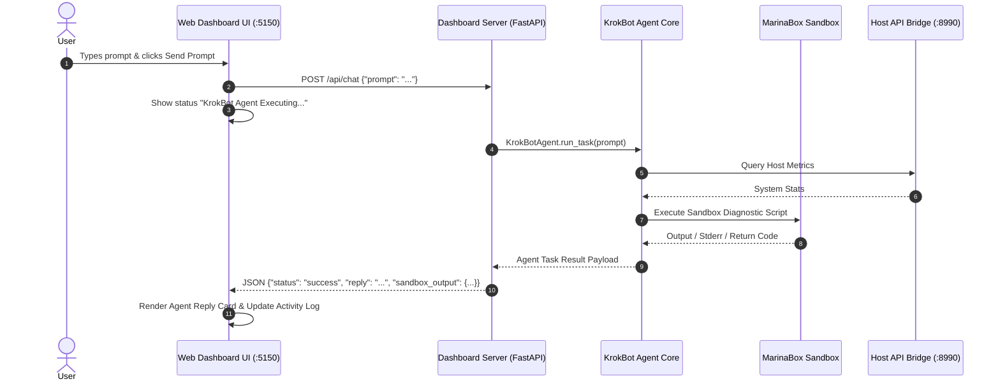

# Design Spec: KrokBot Web UI Interactive Chat Terminal

**Date**: 2026-09-10  
**Status**: Approved  
**Author**: Antigravity & User  

---

## 1. Overview & Objectives

This specification adds an **Interactive Command & Chat Terminal** to the KrokBot Web Dashboard (`http://localhost:5150`). Users can type any custom task prompt or instruction directly into the web interface (e.g. *"Check disk storage and schedule a daily audit at 2:00 AM"*), which KrokBot executes using its Host Bridge, MarinaBox compute sandbox, and local Ollama LLM.

---

## 2. Interface Mockup & UI Design


### UI Layout Components (`krokbot/dashboard/static/index.html`)
1. **Interactive Chat Container**:
   - Styled dark-glassmorphism window displaying chat history.
   - User messages styled with green prompt prefix `user > `.
   - Agent messages styled with cyan prefix `krokbot > ` and code blocks for script outputs.
2. **Command Input Bar**:
   - Input field: `Type your command or request for KrokBot...`
   - Action Button: `Send Prompt` (supports pressing `Enter`).
   - Loading indicator when agent is actively executing task in MarinaBox sandbox.

---

## 3. Data Flow & REST API Endpoint



### Backend Endpoint Definition (`krokbot/dashboard/server.py`)
* **Endpoint**: `POST /api/chat`
* **Request Payload**:
  ```json
  {
    "prompt": "Inspect memory usage and schedule a check every 2 hours"
  }
  ```
* **Response Payload**:
  ```json
  {
    "status": "success",
    "prompt": "Inspect memory usage and schedule a check every 2 hours",
    "reply": "Memory usage is at 45.2%. Scheduled task 'cron-mem-check' created for every 2 hours.",
    "sandbox_output": {
      "exit_code": 0,
      "stdout": "[SANDBOX DIAGNOSTIC] Complete."
    }
  }
  ```

---

## 4. Verification & Testing Plan

1. **Backend REST API Tests (`tests/test_dashboard.py`)**:
   - Test `POST /api/chat` endpoint returns valid HTTP 200 with agent response structure.
2. **Frontend UI Test**:
   - Verify input submission, loading state toggle, and message card rendering.
3. **End-to-End Test (`tests/test_integration.py`)**:
   - Confirm prompt execution via chat endpoint updates `krokbot_health_report.md` on disk.
