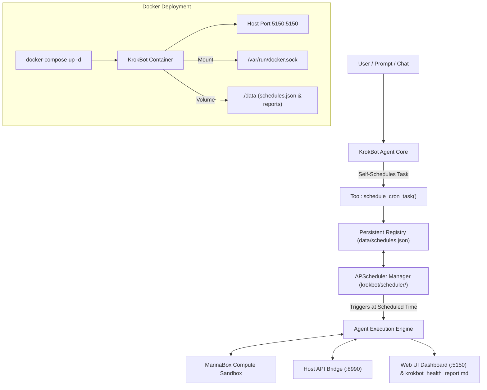

# Design Spec: KrokBot Cron Scheduler, Agent Self-Scheduling & Docker Deployment

**Date**: 2026-09-10  
**Status**: Approved  
**Author**: Antigravity & User  

---

## 1. Overview & Objectives

This specification adds persistent **Cron Task Scheduling**, **Agent Self-Scheduling**, **Docker Containerization**, and updates the main Web UI Dashboard port to **`5150`** for KrokBot.

### Key Features
1. **In-App Background Cron Scheduler (`krokbot/scheduler/`)**: Uses `APScheduler` (`BackgroundScheduler` + `CronTrigger`) to manage cron schedules persistently.
2. **Persistent Schedule Registry (`data/schedules.json`)**: Preserves scheduled tasks, cron expressions (`* * * * *`), next run times, and run status logs across application restarts.
3. **Agent Self-Scheduling Tool (`schedule_cron_task`)**: KrokBot can call `self.tools.schedule_cron_task(name, cron_expr, prompt)` autonomously during any prompt or chat session to schedule future recurring diagnostic checks.
4. **Web UI Scheduled Tasks Panel (`http://localhost:5150`)**: Displays live status of active cron schedules, next run countdowns, and exposes REST endpoints (`GET /api/schedules`, `POST /api/schedules`, `DELETE /api/schedules/{id}`).
5. **Docker & Docker-Compose Containerization (`Dockerfile`, `docker-compose.yml`)**: Packages KrokBot into a reproducible container mounting `/var/run/docker.sock` to launch MarinaBox compute sandboxes seamlessly.
6. **Port Re-assignment**: Changes Web Dashboard port from `8080` to `5150`.

---

## 2. System Architecture



---

## 3. Component Details & REST Interfaces

### A. Scheduler Manager (`krokbot/scheduler/manager.py`)
- Manages an instance of `APScheduler.schedulers.background.BackgroundScheduler`.
- Loads/saves `data/schedules.json`.
- Methods:
  - `load_schedules()`
  - `add_schedule(name: str, cron_expression: str, prompt: str) -> Dict[str, Any]`
  - `remove_schedule(schedule_id: str)`
  - `get_all_schedules() -> List[Dict[str, Any]]`

### B. Agent Tool (`krokbot/agent/tools.py`)
- Exposes `schedule_cron_task(name: str, cron_expression: str, prompt: str)` tool binding.

### C. Dashboard REST API (`krokbot/dashboard/server.py` on Port `5150`)
- `GET /api/schedules` -> returns list of active schedules.
- `POST /api/schedules` -> creates a new schedule.
- `DELETE /api/schedules/{id}` -> deletes a schedule.

### D. Docker Deployment Configuration
- **`Dockerfile`**: Python 3.12-slim base, installs requirements, exposes ports `5150` and `8990`.
- **`docker-compose.yml`**:
  - Services: `krokbot`
  - Ports: `"5150:5150"`, `"8990:8990"`
  - Volumes: `./data:/app/data`, `/var/run/docker.sock:/var/run/docker.sock`
  - Environment: `OLLAMA_HOST=http://host.docker.internal:11434`

---

## 4. Directory Structure

```
krokbot/
├── krokbot/
│   ├── bridge/                # Host API Bridge (:8990)
│   ├── sandbox/               # MarinaBox Sandbox Executor
│   ├── agent/                 # Agent Core & ToolRegistry (includes schedule_cron_task)
│   ├── scheduler/             # APScheduler Manager & Cron triggers
│   │   ├── __init__.py
│   │   └── manager.py
│   ├── dashboard/             # Web UI Dashboard (:5150)
│   └── main.py                # Main Entrypoint Orchestrator
├── data/
│   └── schedules.json         # Persistent Cron Registry
├── docs/
│   └── superpowers/
│       └── specs/
│           └── 2026-09-10-krokbot-cron-docker-design.md
├── Dockerfile                 # Docker container specification
├── docker-compose.yml         # Compose stack specification
├── requirements.txt           # Python dependencies (includes apscheduler)
└── README.md                  # Quickstart guide (updated for port 5150 & Docker)
```

---

## 5. Verification & Testing Plan

1. **Scheduler Unit Tests (`tests/test_scheduler.py`)**:
   - Verify adding, persisting, loading, and removing cron jobs in `schedules.json`.
2. **Port 5150 Dashboard Tests (`tests/test_dashboard.py`)**:
   - Verify index page and `/api/schedules` endpoint return valid HTTP 200 on port 5150.
3. **Agent Self-Scheduling Test (`tests/test_agent.py`)**:
   - Test agent tool call to `schedule_cron_task` registers task successfully.
4. **End-to-End & Docker Build Test**:
   - Verify full pytest suite passes.
