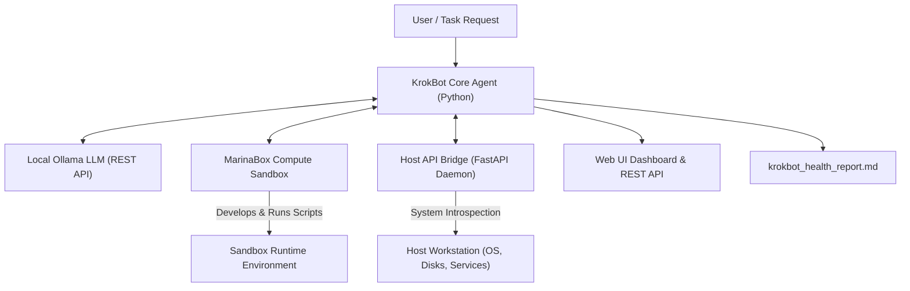
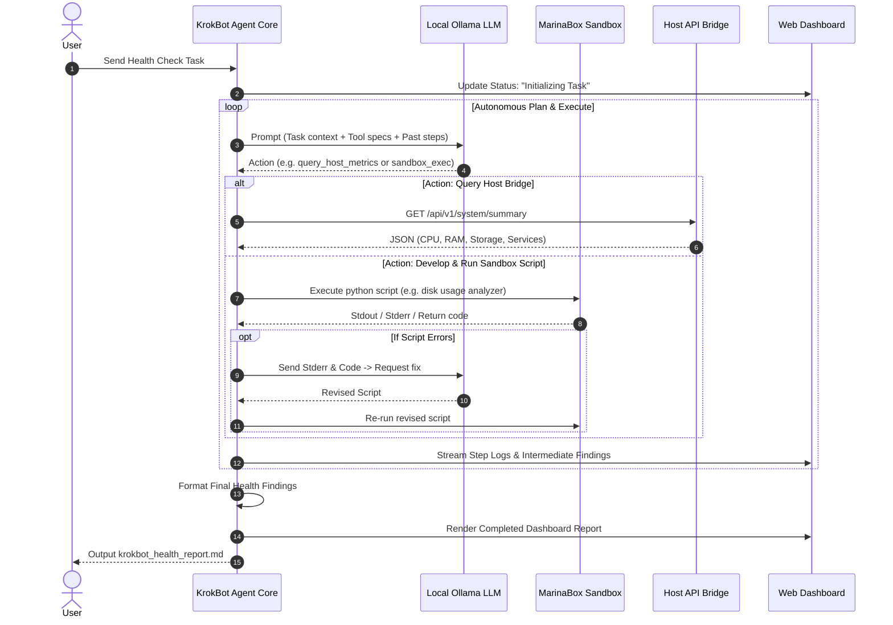

# Design Spec: KrokBot Proof of Concept (Autonomous Workstation Health & Diagnostic Agent)

**Date**: 2026-09-10  
**Status**: Approved  
**Author**: Antigravity & User  

---

## 1. Overview & Objectives

**KrokBot** is a proof-of-concept autonomous agent inspired by GrokBot. It features a single-agent architecture with virtual compute capabilities powered by **MarinaBox**. Given a high-level task, KrokBot autonomously inspects the user's workstation OS, storage, and running services, writes and executes diagnostic scripts in its sandbox compute environment, self-corrects script errors, and reports findings back to the user via a live Web Dashboard and a structured Markdown health report.

### Key Goals
* **Autonomous Task Solving**: No pre-scripted diagnostic steps; the agent plans its actions and generates python/bash scripts dynamically based on system state.
* **Isolated Virtual Compute**: Uses `marinabox` Python SDK to create isolated execution environments where dynamic diagnostic code can be safely developed and tested.
* **Host Introspection**: Connects to a local `Host API Bridge` daemon to inspect host metrics (CPU, RAM, Disks, Services) securely.
* **Local Offline Reasoning**: Powered by a local Ollama LLM instance (`http://localhost:11434`).
* **Dual Reporting**: Displays live agent execution status and metrics on a web dashboard (`http://localhost:8080`) and generates a persistent `krokbot_health_report.md` file.

---

## 2. System Architecture



### Component Boundaries & Responsibilities

1. **Host API Bridge (`krokbot/bridge/`)**
   - **Port**: `8990`
   - **Service**: FastAPI daemon running on the host OS.
   - **Endpoints**:
     - `GET /api/v1/system/summary` — CPU, RAM, OS info, battery/uptime.
     - `GET /api/v1/system/storage` — Disk partition details and mount usage.
     - `GET /api/v1/services/list` — Active processes and running background services.
     - `POST /api/v1/exec/safe-command` — Executes bounded diagnostic commands (e.g. `ping`, `netstat`, `df`).

2. **MarinaBox Compute Sandbox (`krokbot/sandbox/`)**
   - **Service**: Python wrapper around `marinabox` SDK.
   - **Responsibility**: Allocates isolated python sandboxes for KrokBot to run generated diagnostic scripts without risking host OS file corruption or accidental system modifications.

3. **KrokBot Core Agent (`krokbot/agent/`)**
   - **Engine**: ReAct loop connecting to Ollama (`http://localhost:11434/api/chat`).
   - **Tools**:
     - `query_host_metrics(category)`
     - `run_sandbox_script(code_string, script_language)`
     - `write_markdown_report(report_content)`
     - `update_dashboard_status(step_name, data)`

4. **Web UI & Reporting (`krokbot/dashboard/`)**
   - **Port**: `8080`
   - **Frontend**: Responsive dark-mode UI displaying live log stream, agent status steps, and system metric widgets.
   - **File Output**: `krokbot_health_report.md` written to the workspace root.

---

## 3. Execution & Troubleshooting Flow



### Self-Correction Mechanism
If a dynamically created python script fails in the MarinaBox sandbox, the agent captures the `stderr` and exception traceback, passes it back to Ollama with the prompt: *"The script failed with stderr: `<trace>`. Fix the code and retry."* The agent allows up to 3 retries per sub-task.

---

## 4. Repository Directory Structure

```
krokbot/
├── krokbot/
│   ├── __init__.py
│   ├── bridge/
│   │   ├── main.py            # FastAPI Host Bridge Daemon (Port 8990)
│   │   ├── metrics.py         # System stats (CPU, RAM, Disk, Services via psutil)
│   │   └── schemas.py         # Pydantic data schemas
│   ├── sandbox/
│   │   └── executor.py        # MarinaBox SDK wrapper for code execution
│   ├── agent/
│   │   ├── core.py            # ReAct agent loop
│   │   ├── ollama_client.py   # Ollama API client (llama3.2 / qwen2.5-coder)
│   │   └── tools.py           # Agent tool definitions (host query, sandbox run, report gen)
│   ├── dashboard/
│   │   ├── server.py          # FastAPI Web Dashboard (Port 8080)
│   │   └── static/
│   │       ├── index.html     # Live status dashboard UI
│   │       └── style.css      # Dark-mode styling
│   └── main.py                # KrokBot orchestrator CLI entry point
├── docs/
│   └── superpowers/
│       └── specs/
│           └── 2026-09-10-krokbot-design.md
├── krokbot_health_report.md   # Output report file
├── requirements.txt           # Python dependencies
└── README.md                  # Quickstart & run instructions
```

---

## 5. Verification & Testing Plan

1. **Host Bridge Test**: Execute `python -m krokbot.bridge.main` and query `http://localhost:8990/api/v1/system/summary` to verify correct `psutil` system metrics payload.
2. **MarinaBox Sandbox Test**: Verify script creation and execution via MarinaBox Python SDK in `krokbot/sandbox/executor.py`.
3. **Agent ReAct Loop Test**: Run KrokBot with Ollama to execute the system health check task end-to-end.
4. **Dashboard & Report Verification**: Confirm `http://localhost:8080` renders live status and `krokbot_health_report.md` is generated on disk.
