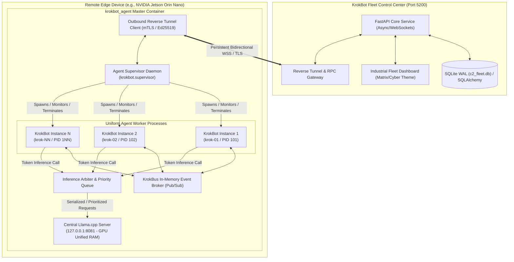
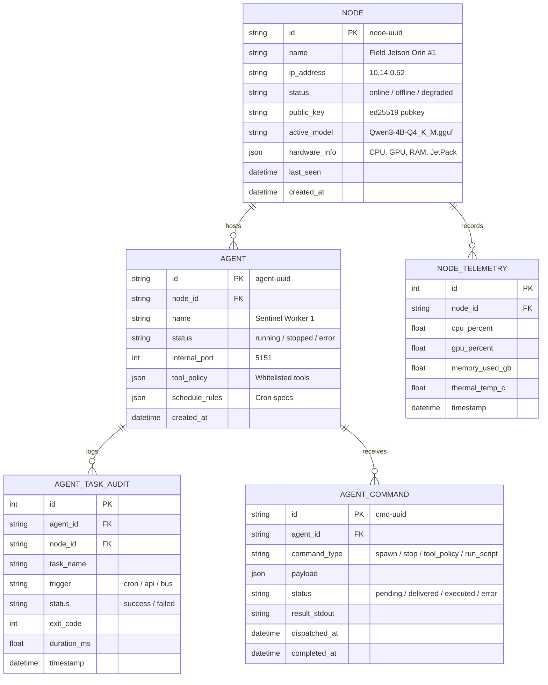

# Technical Design Specification: KrokBot Fleet Control Center (C2) & Multi-Agent Edge Framework

**Date**: 2026-09-11  
**Status**: Proposed / Under Review  
**Branch**: `control_center`  
**Target Architecture**: Multi-Agent Edge IoT (NVIDIA Jetson, Raspberry Pi, Edge Gateways, Cloud/Workstations)  

---

## 1. Executive Summary & Core Objectives

The **KrokBot Fleet Control Center (C2)** is a standalone web application and orchestration platform designed to manage, monitor, and deploy autonomous KrokBot agents across a fleet of remote edge devices. 

Unlike consumer AI productivity tools, KrokBot is engineered as a **distributed, autonomous multi-agent operating system for edge IoT environments** (such as NVIDIA Jetson Orin/Nano platforms) where compute, unified RAM/VRAM, and network bandwidth are constrained, and devices frequently operate behind NATs, cellular carriers (4G/5G), and restrictive firewalls.

### Key Capabilities
1. **Centralized Fleet Orchestration**: A standalone web service providing real-time telemetry, remote execution, tool policy enforcement, and model management across all registered edge nodes.
2. **Cryptographically Secure Zero-Touch Enrollment**: Reverse mTLS and Ed25519 handshake enabling edge nodes behind private NATs to phone-home and establish persistent bidirectional control tunnels without opening inbound firewall ports.
3. **Uniform Multi-Agent Container Co-Location**: An in-container **Agent Supervisor Daemon** capable of dynamically deploying and isolating uniform `KrokBotInstance` units inside an existing Docker deployment without leaking host Docker daemon privileges.
4. **Shared Llama.cpp Inference Arbiter**: A centralized, priority-queued inference broker that multiplexes concurrent agent LLM requests against a single in-container `llama.cpp` instance on `127.0.0.1:8081`, preventing GPU out-of-memory (OOM) crashes and context thrashing on unified memory Jetson architectures.
5. **KrokBus Event Broker**: An in-container pub/sub event bus enabling decoupled inter-agent event distribution, reactive workflows, and future expansion (e.g., bridging to MQTT/ROS2).

---

## 2. System Architecture & Topology



---

## 3. Cryptographic Security & Reverse Registration Protocol

### 3.1 Overcoming Edge NAT and Firewall Restrictions
In field deployments, Jetson devices connect via cellular modems, satellite links, or private factory intranets where:
* Inbound ports are unreachable from the outside world.
* Public static IPs are unavailable or prohibitively expensive.

**Protocol Design**: **Outbound Reverse Connection via Mutual TLS / Ed25519**.
1. **Enrollment Token Creation**: Control Center administrator clicks "Generate Enrollment Token". C2 issues a cryptographically random, signed token with an expiration (e.g., `krok_enroll_9f82ab47...`).
2. **Agent Bootstrapping**:
   The edge container starts with two environment variables:
   ```bash
   C2_URL=wss://c2.internal.network:5200
   C2_ENROLL_TOKEN=krok_enroll_9f82ab47...
   ```
3. **Key Generation & Attestation**:
   * The edge node generates an **Ed25519** keypair locally in `/app/certs/device_key.pem`.
   * It initiates an outbound TLS handshake to the Control Center and submits its public key + enrollment token + hardware telemetry (CPU model, Jetson JetPack version, GPU core count, Total RAM).
4. **Certificate Issuance & Node Registration**:
   * Control Center validates the token, signs the node public key, assigns a unique `NodeID` (e.g., `node-jetson-orin-01`), and records it in `c2_fleet.db`.
5. **Persistent Multiplexed WSS Tunnel**:
   * The node establishes an encrypted outbound WebSocket connection: `wss://<C2_URL>/api/v1/tunnel`.
   * Heartbeats, telemetry streaming, and bi-directional RPC commands travel across this single persistent connection.
   * If the connection drops, exponential backoff reconnects automatically.

---

## 4. In-Container Multi-Agent Architecture

### 4.1 Why Inside the Container (Process Supervisor vs. Docker-in-Docker)?
* **Security**: Exposing `/var/run/docker.sock` to an edge container gives it root control over the host OS, creating a massive security vulnerability.
* **Footprint**: Spinning up separate containers per agent duplicates base OS memory overhead (~150MB per container). On an 8GB Jetson, this quickly exhausts RAM.
* **Solution**: A **Supervised Multi-Process Architecture**. The master container runs an `AgentSupervisor` daemon that isolates agents as lightweight, independent OS subprocesses.

### 4.2 Uniform Base-Level Agent Units (`KrokBotInstance`)
Every agent deployed into the container is completely uniform at instantiation:
* **Identical Engine**: Possesses the full KrokBot autonomy suite (LLM client, task scheduler, tool runner, shell sandbox, audit logger, memory engine).
* **Base Identity Specification**: Every agent configuration mandates a globally unique identifying ID and a descriptive human-readable name:
  ```yaml
  agent:
    id: "krok-prime-01"            # Unique slug/UUID identifying the agent instance
    name: "KrokBot Prime Sentinel" # Human-readable descriptive name
    dashboard_port: 5150
    bridge_port: 8990
    default_temperature: 0.2
  ```
* **Isolated Environment**:
  ```text
  /app/workspaces/
    └── agent_<id>/
        ├── agent_config.yaml       # Unique agent.id, agent.name, port, tool policy
        ├── agent_tasks.sqlite3     # Local independent audit/task log
        ├── scripts/                # Local saved scripts library
        └── workspace/              # Sandboxed execution directory
  ```
* **Post-Deployment Parameterization**: Once deployed, the Control Center identifies the agent by its unique `id`, and can update its directives, scheduled cron jobs, and tool permissions via API.

---

## 5. Inference Arbiter & Shared Llama.cpp Engine

### 5.1 The Unified Memory (VRAM) Concurrency Problem
NVIDIA Jetson architectures share physical LPDDR RAM between CPU and GPU (e.g., Jetson Orin Nano has 8GB total).
If 3 agents send concurrent 2048-token generation requests to `llama_cpp.server` on port 8081:
* The CUDA context attempts simultaneous memory allocations.
* Inference throughput drops drastically due to context thrashing, or the server crashes with `CUDA out of memory`.

### 5.2 The Inference Arbiter Design (`krokbot.arbiter`)
The master container runs an internal proxy/arbiter on `127.0.0.1:8080` (intercepting between agents and `llama_cpp.server` on `8081`):
* **Priority-Based Async Queue**:
  * **Priority 1 (Urgent/Safety)**: Immediate hardware interrupts, safety halts, critical sensor tripwires.
  * **Priority 2 (Scheduled/Cron)**: Routine cron tasks, monitoring passes.
  * **Priority 3 (Interactive/Background)**: Diagnostic chats, long-term memory summarization.
* **Fair Slot Allocation**: Guarantees FIFO within identical priority tiers and enforces maximum execution timeouts (default: 45s) to prevent a stalled agent from starving the fleet.
* **Token Rate Throttling**: Monitors Jetson thermal and compute stats; if thermal throttle is detected, adds cooling delays between heavy prompt evaluations.

---

## 6. Inter-Agent Communication: The `KrokBus` Event Broker

### 6.1 Purpose
Enables agents within a node (and optionally across the fleet via C2 relay) to collaborate, react to real-time events, and trigger complex autonomous workflows.

### 6.2 Architecture
* **Lightweight In-Memory + SQLite WAL Pub/Sub**:
  * Zero external broker dependencies (no external RabbitMQ or Kafka required).
  * Agents subscribe to topic wildcard patterns (e.g., `sensors/#`, `weather/dublin`, `agents/krok-01/status`).
  * Publishing an event:
    ```python
    await krok_bus.publish(
        topic="sensors.temperature.critical",
        payload={"sensor_id": "jetson_thermal_zone_0", "temp_c": 82.5},
        source_agent="krok-sentinel"
    )
    ```
* **Future-Proof Extensibility**:
  * Includes an optional **MQTT/ROS2 Connector Bridge** to connect KrokBus directly into robotics middleware or standard industrial SCADA systems.

---

## 7. Control Center (C2) Web Application Stack

### 7.1 Tech Stack
* **Framework**: Next.js 15+ (App Router, TypeScript, React Server Components & Server Actions).
* **Runtime**: Node.js (v22 LTS).
* **Database**: Local SQLite in **WAL (Write-Ahead Logging)** mode via Prisma ORM / better-sqlite3:
  * Zero server administration, single file (`c2_fleet.db`).
  * Auto-migrated schema with strong TypeScript typing and relation safety.
* **Frontend Design System**:
  * Pure CSS Modules / Vanilla CSS Design Tokens (Inter / Outfit / JetBrains Mono typography).
  * Cyber-Industrial themes matching KrokBot (Matrix Phosphor, Amber CRT, Slate Industrial).
  * Real-time Server-Sent Events (SSE) and reactive client hooks for fleet state updates without page reloads.
* **Default Port**: `5200` (e.g. `npm run dev -- -p 5200` or `PORT=5200`).

### 7.2 Core Database Schema (`c2_fleet.db`)



---

## 8. Control Center UI / UX Functional Layout

The C2 dashboard runs at `http://localhost:5200` and features five core operations panels:

1. **Fleet Topology & Map Panel**:
   * Card grid of all registered edge nodes with online/offline indicators, latency ping, active model, and temperature telemetry.
   * Filter by status (Healthy, Alert, Offline) or tag (Jetson, Gateway, Cloud).
2. **Node Detail & Multi-Agent Manager**:
   * Inspect a selected edge node.
   * View all running agents inside the node's container with CPU/RAM metrics per agent.
   * **`[+ Deploy New Agent]` Button**: Instantly provisions a new uniform agent into the container.
   * Control tile for each agent: Start, Stop, Restart, Inspect Logs, Terminal Connect.
3. **Fleet Llama.cpp & Model Engine Manager**:
   * View the loaded model and VRAM usage on each node.
   * Remotely trigger model switches (e.g., switch Jetson #1 from Qwen3-4B to Qwen2.5-Coder-1.5B).
   * Push HuggingFace model download jobs to edge nodes.
4. **Unified Fleet Audit Log**:
   * Real-time streaming log of all tool executions, cron tasks, and errors across the entire fleet.
   * Filterable by Node, Agent, Status (Success/Failure), or Search query.
5. **Interactive C2 Fleet Terminal**:
   * Send direct shell commands, agent prompts, or test scripts to any remote agent through the reverse tunnel.

---

## 9. Implementation Phases & Roadmap

* **Phase 1: In-Container Multi-Agent Infrastructure**
  * Implement `krokbot.supervisor` (process manager for multiple `KrokBotInstance` units).
  * Implement `krokbot.arbiter` (async priority queue for shared `llama.cpp` on 8081).
  * Implement `krokbot.bus` (`KrokBus` event broker).
* **Phase 2: Cryptographic Tunnel & Edge Client**
  * Implement reverse WebSocket tunnel client on the agent side.
  * Implement Ed25519 enrollment and handshake verification.
* **Phase 3: Standalone Control Center (C2) Next.js Web Application**
  * Scaffold `control_center/` application using Next.js 15+ (App Router, TypeScript).
  * Configure local SQLite database in WAL mode using Prisma ORM (`c2_fleet.db`).
  * Implement Route Handlers (`/api/nodes`, `/api/nodes/[id]/agents`, `/api/nodes/[id]/deploy`, `/api/telemetry`).
* **Phase 4: Next.js Industrial Fleet Operations UI**
  * Build responsive, reactive components using Pure CSS Modules and cyber-industrial design tokens on port `5200`.
  * Fleet overview grid, multi-agent orchestrator panel, model manager, and live SSE telemetry stream.
* **Phase 5: End-to-End Integration Testing**
  * Multi-agent co-location verification inside Docker.
  * Test C2 deploying an agent into the running container and executing remote API commands.
